## Building a Web Application with Spring Boot and Angular 

**Pre-Req: Java Setup Gitpod**

1. Open the Gitpod workspace.

2. In the terminal, use the following commands to update the Java version:

   ```bash
   # List available Java versions
   sdk list java

   # Install and set the desired Java version
   sdk install java 17.0.8-oracle
   sdk use java 17.0.8-oracle


**1. Overview**

Spring Boot and [Angular](https://angular.io/) form a
powerful tandem that works great for developing web applications with a
minimal footprint.

In this lab, we\'ll use Spring Boot for implementing a RESTful backend, and
[Angular](https://angular.io/) for creating a
JavaScript-based frontend.**


**2. The Spring Boot Application**

Our demo web application\'s functionality will be pretty simplistic
indeed. It\'ll be narrowed to fetching and displaying a *List* of JPA
entities from an in-memory `H2 database`,
and persisting new ones through a plain HTML form.


Complete the following steps to use Spring Initializr to set up the spring boot application.

1. Open **Spring Initializr** in web browser: `https://start.spring.io/`

    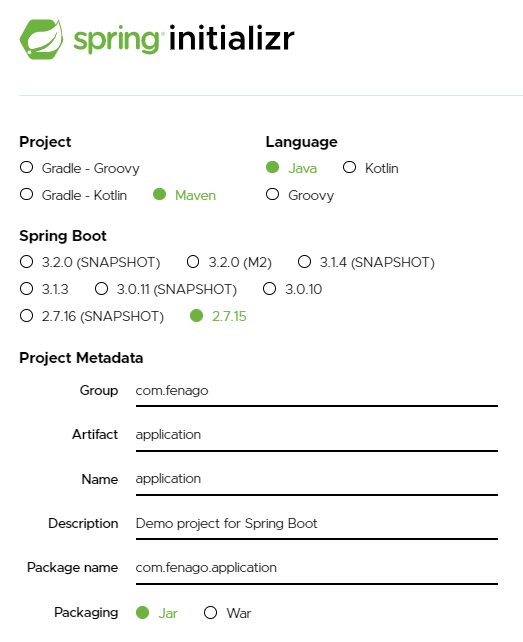

2. Select the following options:

    Project: **Maven**
    
    Language: **Java**

    SpringBoot: **Choose the 2.7.15 or 2.x version**

3. Enter the following values next the corresponding Project Metadata fields:

    Group: `com.fenago`

    Artifact: `application`

    Name: `application`

    Packaging: `Jar`

    Java: `17`

**Note:** You do not have to enter the "Package name" field -- Spring Initializr will fill this in for you!

4. Select the **ADD DEPENDENCIES...** button from the **Dependencies** panel.

    

5. Select the following option, since we know that we will be creating a web application:

    Web options: **Spring Web**

    Spring Data JPA: **Spring Data JPA**
    
    H2 Database: **H2 Database**

    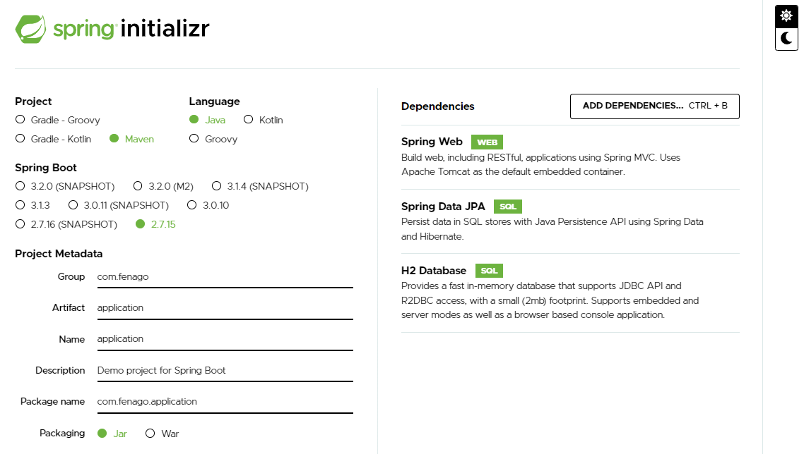

Later in the lab, you will be adding additional dependencies without using Spring Initializr.

6. Click the **GENERATE** button. Spring Initializr generates a zip file of code and download it.

7. **Note** run the below command in your terminal to download above project.

```
mkdir lab1 && cd lab1 

curl -o 'application.zip' 'https://start.spring.io/starter.zip?type=maven-project&language=java&dependencies=web%2Cdata-jpa%2Ch2&name=application&groupId=com.fenago&artifactId=application&description=Demo+project+for+Spring+Boot&packaging=jar&packageName=com.fenago.application&javaVersion=17' && unzip -d 'application' 'application.zip'
```
 
8. From the command line in the Terminal tab, enter the following commands to use the gradle wrapper to build and test the generated application.

Go to the application directory in the Terminal dashboard tab.

```
[~] $ cd application
[~/application] $ 
```

Next, run the `mvn install` command:

`[~/application] $ mvn install`

```
[INFO] Installing /workspace/angular-advanced-springboot/lab1/application/target/application-0.0.1-SNAPSHOT.jar to /workspace/m2-repository/com/fenago/application/0.0.1-SNAPSHOT/application-0.0.1-SNAPSHOT.jar
[INFO] Installing /workspace/angular-advanced-springboot/lab1/application/pom.xml to /workspace/m2-repository/com/fenago/application/0.0.1-SNAPSHOT/application-0.0.1-SNAPSHOT.pom
[INFO] ------------------------------------------------------------------------
[INFO] BUILD SUCCESS
[INFO] ------------------------------------------------------------------------
[INFO] Total time:  18.723 s
[INFO] Finished at: 2023-08-27T21:11:50Z
[INFO] ------------------------------------------------------------------------
```

The output will show that the application passed the tests and was successfully built.

**Congrats!** You’ve just learned how to quickly and easily bootstrap a Spring Boot codebase using Spring Initializr.


**2.1. The Maven Dependencies**

1. Open `pom.xml` in the editor and update spring boot version to `2.7.15`

  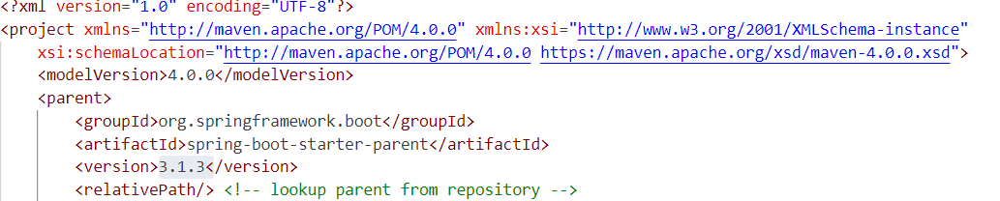

2. Also, add following dependency in the project's pom.xml:

  ```
        <dependency>
                <groupId>javax.persistence</groupId>
                <artifactId>javax.persistence-api</artifactId>
                <version>2.2</version>
        </dependency>
  ```

After making the changes, `pom.xml` should like this: `https://github.com/fenago/angular-advanced-springboot/blob/main/labs/lab1/application/pom.xml`


Note that we included
*[spring-boot-starter-web](https://mvnrepository.com/artifact/org.springframework.boot/spring-boot-starter-web)*
because we\'ll use it for creating the REST service, and
*[spring-boot-starter-jpa](https://mvnrepository.com/artifact/org.springframework.boot/spring-boot-starter-data-jpa)*
for implementing the persistence layer.


The [H2 database](https://mvnrepository.com/artifact/com.h2database/h2)
version is also managed by the Spring Boot parent.

**2.2. The JPA Entity Class**

To quickly prototype our application\'s domain layer, let\'s define a
simple JPA entity class, which will be responsible for modeling users.

Create new file in the maven project: `application/src/main/java/com/fenago/application/entities/Users.java` and add following code:


```
package com.fenago.application.entities;

import javax.persistence.Entity;
import javax.persistence.GeneratedValue;
import javax.persistence.GenerationType;
import javax.persistence.Id;

@Entity
public class Users {
    
    @Id
    @GeneratedValue(strategy = GenerationType.AUTO)
    private long id;
    private final String name;
    private final String email;
    
    public Users() {
        this.name = "";
        this.email = "";
    }
    
    public Users(String name, String email) {
        this.name = name;
        this.email = email;
    }

    public long getId() {
        return id;
    }
    
    public String getName() {
        return name;
    }

    public String getEmail() {
        return email;
    }
    
    @Override
    public String toString() {
        return "User{" + "id=" + id + ", name=" + name + ", email=" + email + '}';
    }
}
```

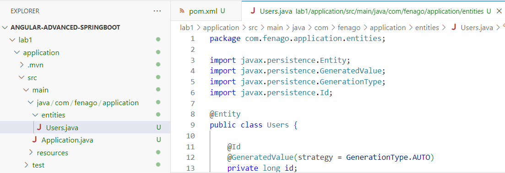

**2.3. The *UserRepository* Interface**

Create new file in the maven project: `application/src/main/java/com/fenago/application/repositories/UserRepository.java` and add following code.

Since we\'ll need basic CRUD functionality on the *User* entities, we
must also define a *UserRepository* interface:

```
package com.fenago.application.repositories;

import com.fenago.application.entities.Users;
import org.springframework.data.repository.CrudRepository;
import org.springframework.stereotype.Repository;
import org.springframework.web.bind.annotation.CrossOrigin;

@Repository
public interface UserRepository extends CrudRepository<Users, Long>{}
```

**2.4. The REST Controller**

Create new file in the maven project: `application/src/main/java/com/fenago/application/repositories/UserController.java` and add following code:

Now let\'s implement the REST API. In this case, it\'s just a simple
REST controller:

```
package com.fenago.application.controllers;

import com.fenago.application.entities.Users;
import com.fenago.application.repositories.UserRepository;
import java.util.List;
import org.springframework.web.bind.annotation.CrossOrigin;
import org.springframework.web.bind.annotation.GetMapping;
import org.springframework.web.bind.annotation.PostMapping;
import org.springframework.web.bind.annotation.RequestBody;
import org.springframework.web.bind.annotation.RestController;

@RestController
@CrossOrigin(origins = "*")
public class UserController {

    private final UserRepository userRepository;

    public UserController(UserRepository userRepository) {
        this.userRepository = userRepository;
    }

    @GetMapping("/users")
    public List<Users> getUsers() {
        return (List<Users>) userRepository.findAll();
    }

    @PostMapping("/users")
    void addUser(@RequestBody Users user) {
        userRepository.save(user);
    }
}
```

There\'s nothing inherently complex in the definition of the
*UserController* class.


Of course, the implementation detail worth noting here is the use of
the *\@CrossOrigin* annotation. As the name implies, the annotation enables **Cross-Origin Resource Sharing(CORS)** on the server.

This step isn\'t always necessary, but since we\'re deploying our
Angular frontend to *https://4200-GITPOD_URL*,
and our Boot backend to *https://8080-GITPOD_URL*, 
**the browser would otherwise deny requests from one to the other.**

Regarding the controller methods, *getUser()* fetches all the *User*
entities from the database. Similarly, the *addUser()* method persists a
new entity in the database, which is passed in the `request body`.

To keep things simple, we deliberately left out the controller
implementation triggering Spring Boot validation
before persisting an entity. In production, however, we can\'t trust
user input alone, so server-side validation should be a mandatory
feature.

**2.5. Bootstrapping the Spring Boot Application**

Finally, let\'s create a standard Spring Boot bootstrapping class, and
populate the database with a few *User* entities:


```
package com.fenago.application;

import com.fenago.application.entities.Users;
import com.fenago.application.repositories.UserRepository;
import java.util.stream.Stream;
import org.springframework.boot.CommandLineRunner;
import org.springframework.boot.SpringApplication;
import org.springframework.boot.autoconfigure.SpringBootApplication;
import org.springframework.context.annotation.Bean;

@SpringBootApplication
public class Application {

    public static void main(String[] args) {
        SpringApplication.run(Application.class, args);
    }

    @Bean
    CommandLineRunner init(UserRepository userRepository) {
        return args -> {
            Stream.of("John", "Julie", "Jennifer", "Helen", "Rachel").forEach(name -> {
                Users user = new Users(name, name.toLowerCase() + "@domain.com");
                userRepository.save(user);
            });
            userRepository.findAll().forEach(System.out::println);
        };
    }
}
```

Now let\'s run the application: `mvn spring-boot:run`

As expected, we should see a list of
*User* entities printed out to the console on startup:

```
User{id=1, name=John, email=john@domain.com}
User{id=2, name=Julie, email=julie@domain.com}
User{id=3, name=Jennifer, email=jennifer@domain.com}
User{id=4, name=Helen, email=helen@domain.com}
User{id=5, name=Rachel, email=rachel@domain.com}
```


You can test the /user endpoint outside gitpod environment like this:

`https://8080-YOUR_GITPOD_URL.gitpod.io/users`

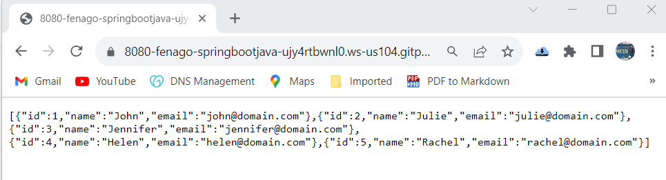


**3. The Angular Application**

With our Spring Boot application up and running, we can now create
a simple Angular application capable of consuming the REST controller
API.

**3.1. Angular CLI Installation**

We\'ll use Angular CLI, a powerful
command-line utility, to create our Angular application.

Angular CLI is an extremely valuable tool since **it allows us to create
an entire Angular project from scratch, generating components, services,
classes, and interfaces with just a few commands**.

Let's open a new command console and type the command:

```
npm install -g @angular/cli
```

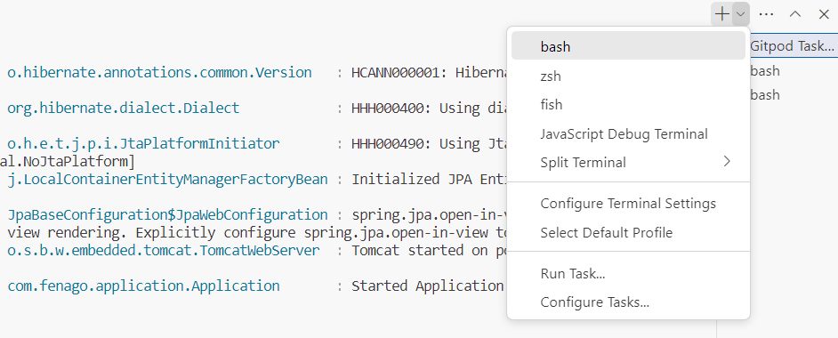

That\'s it. The above command will install the latest version of Angular
CLI.

### 3.2. Project Scaffolding With Angular CLI


We can generate our Angular application structure from the ground up,
but honestly, this is an error-prone and time-consuming task that we
should avoid in all cases.

Instead, we\'ll let Angular CLI do the hard work for us. So we can open
a command console, then navigate to the folder where we want our
application to be created, and type the command:


```
ng new angularclient
```

The *new* command will generate the entire application structure within
the *angularclient* directory.

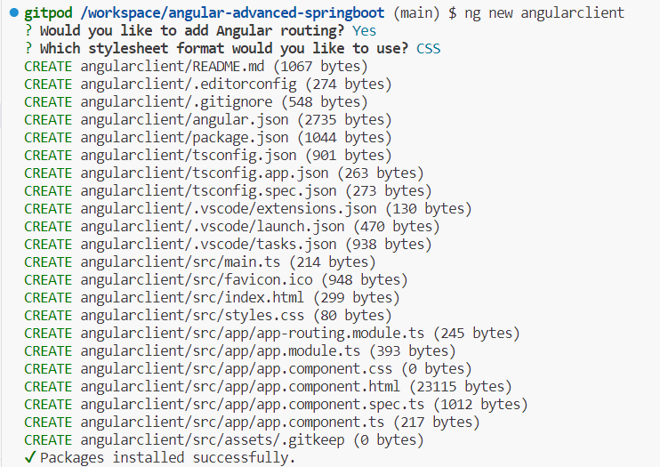

**Important:** Open `angularclient/tsconfig.json` file in the editor and set strict to false:

`"strict": false`

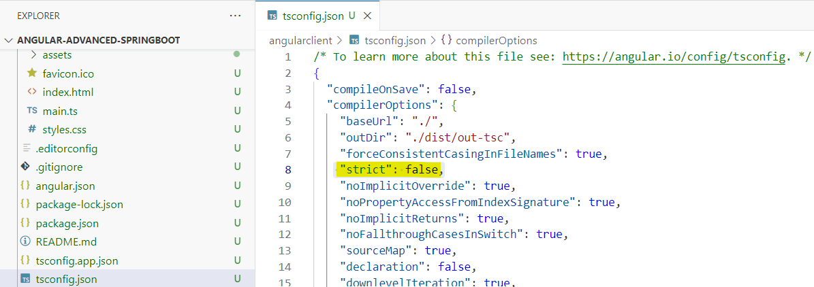

**3.3. The Angular Application\'s Entry Point**

If we look inside the *angularclient* folder, we\'ll see that Angular
CLI has effectively created an entire project for us.

**Angular\'s** application files use `TypeScript`
a typed superset of JavaScript that compiles to plain JavaScript.
However, the entry point of any Angular application is a plain old
*index.html* file.

Let\'s edit this file:

```
<!doctype html>
<html lang="en">

<head>
  <meta charset="utf-8">
  <title>Spring Boot - Angular Application</title>
  <base href="/">

  <meta name="viewport" content="width=device-width, initial-scale=1">
  <link rel="icon" type="image/x-icon" href="favicon.ico">
  <link rel="stylesheet" href="https://maxcdn.bootstrapcdn.com/bootstrap/4.0.0/css/bootstrap.min.css" integrity="sha384-Gn5384xqQ1aoWXA+058RXPxPg6fy4IWvTNh0E263XmFcJlSAwiGgFAW/dAiS6JXm"
    crossorigin="anonymous">
</head>
<body>
  <app-root></app-root>
</body>
</html>
```

As we can see above, we included [Bootstrap 4](https://getbootstrap.com/) so we can give
our application UI components a more fancy look. Of course, it\'s
possible to pick up another UI kit from the bunch available out there.

Please notice the custom *\<app-root\>\</app-root\>* tags inside the
*\<body\>* section. At first glance, they look rather weird, as
*\<app-root\>* is not a standard HTML 5 element.

We\'ll keep them there, as ***\<app-root\>* is the root selector that
Angular uses for rendering the application\'s root component**.

**3.4. The *app.component.ts* Root Component**


To better understand how Angular binds an HTML template to a component,
let\'s go to the *src/app* directory and edit the *app.component.ts*
TypeScript file, the root component:


```
import { Component } from '@angular/core';

@Component({
  selector: 'app-root',
  templateUrl: './app.component.html',
  styleUrls: ['./app.component.css']
})
export class AppComponent {

  title: string;

  constructor() {
    this.title = 'Spring Boot - Angular Application';
  }
}
```

For obvious reasons, we won\'t dive deep into learning TypeScript. Even
so, let\'s note that the file defines an *AppComponent* class, which
declares a field *title* of type *string* (lower-cased). Definitively,
it\'s typed JavaScript.

Additionally, the constructor initializes the field with a *string*
value, which is pretty similar to what we do in Java.

The most relevant part is **the *\@Component* metadata marker or
decorator**, which defines three elements:

1.  *selector* -- the HTML selector used to bind the component to the
    HTML template file
2.  *templateUrl* -- the HTML template file associated with the
    component
3.  *styleUrls* -- one or more CSS files associated with the component

As expected, we can use the *app.component.html* and *app.component.css*
files to define the HTML template and the CSS styles of the root
component.

Finally, the *selector* element binds the whole component to the
*\<app-root\>* selector included in the *index.html* file.

**3.5. The *app.component.html* File**


Since the *app.component.html* file allows us to **define the root
component\'s HTML template,** the *AppComponent* class, we\'ll use it
for creating a basic navigation bar with two buttons.

If we click the first button, Angular will display a table containing
the list of *User* entities stored in the database. Similarly, if we
click the second one, it will render an HTML form, which we can use for
adding new entities to the database:

```
<div class="container">
  <div class="row">
    <div class="col-md-12">
      <div class="card bg-dark my-5">
        <div class="card-body">
          <h2 class="card-title text-center text-white py-3">{{ title }}</h2>
          <ul class="text-center list-inline py-3">
            <li class="list-inline-item">
              <a routerLink="/users" class="btn btn-info">List Users</a>
                </li>
            <li class="list-inline-item">
              <a routerLink="/adduser" class="btn btn-info">Add User</a>
                </li>
          </ul>
        </div>
      </div>
      <router-outlet></router-outlet>
    </div>
  </div>
</div>
```

The bulk of the file is standard HTML, with a few caveats worth noting.


**The first one is the *{{ title }}* expression. The double curly braces
*{{ variable-name }}* is the placeholder that Angular uses for
performing variable interpolation**.

Let\'s keep in mind that the *AppComponent* class initialized the
*title* field with the value *Spring Boot -- Angular Application*. Thus,
Angular will display the value of this field in the template. Likewise,
changing the value in the constructor will be reflected in the template.

**The second thing to note is the *routerLink* attribute**.

**Angular uses this attribute for routing requests through its routing
module** (more on this later). For now, it\'s sufficient to know that
the module will dispatch a request to the */users* path to a specific
component and a request to */adduser* to another component.

In each case, the HTML template associated with the matching component
will be rendered within the *\<router-outlet\>\</router-outlet\>*
placeholder.

### 3.6. The *User* Class

Since our Angular application will fetch from and persist *User*
entities in the database, let\'s implement a simple domain model with
TypeScript.

Let\'s open a terminal console and create a **model** directory inside **src/app** folder:

```
mkdir model && cd model 

ng generate class user
```

Angular CLI will generate an empty *User* class, so let\'s populate it
with a few fields:


```
export class User {
    id: string;
    name: string;
    email: string;
}
```

### 3.7. The *UserService* Service

With our client-side domain *User* class already set, we can now
implement a service class that performs GET and POST requests to the
[http://localhost:8080/users](http://localhost:8080/users)
endpoint.

**This will allow us to encapsulate access to the REST controller in a
single class, which we can reuse throughout the entire application**.

Let\'s open a console terminal, then create a **service** directory inside **src/app** folder
and within that directory, issue the following command:

```
cd .. 

mkdir service && cd service 

ng generate service user
```


Now let\'s open the *user.service.ts* file that Angular CLI just created
and refactor it:

```
import { Injectable } from '@angular/core';
import { HttpClient, HttpHeaders } from '@angular/common/http';
import { User } from '../model/user';
import { Observable } from 'rxjs';

@Injectable()
export class UserService {

  private usersUrl: string;

  constructor(private http: HttpClient) {
    this.usersUrl = 'https://8080-YOUR_GITPOD_URL.gitpod.io/users';
  }

  public findAll(): Observable<User[]> {
    return this.http.get<User[]>(this.usersUrl);
  }

  public save(user: User) {
    return this.http.post<User>(this.usersUrl, user);
  }
}
```

**Note:** Set `usersUrl` in the *user.service.ts* file. You can get URL like this:
`https://8080-YOUR_GITPOD_URL.gitpod.io/users`

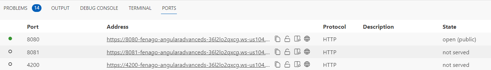

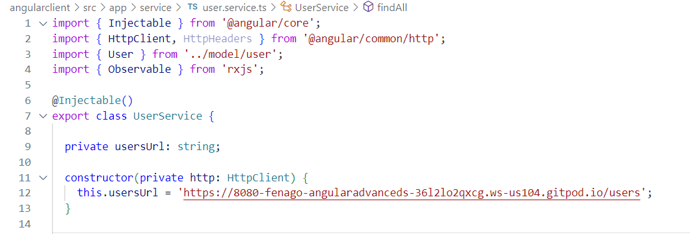


We don\'t need a solid background on TypeScript to understand how the
*UserService* class works. Simply put, it encapsulates within a reusable
component **all the functionality required to consume the REST
controller API that we implemented before** in Spring Boot.

The *findAll()* method performs a GET HTTP request to the
[http://localhost:8080/users](http://localhost:8080/users)
endpoint via [Angular\'s
*HttpClient*](https://angular.io/guide/http).
The method returns an
*[Observable](https://angular.io/guide/observables)*
instance that holds an array of *User* objects.

Likewise, the *save()* method performs a POST HTTP request to the
[http://localhost:8080/users](http://localhost:8080/users)
endpoint.

By specifying the type *User* in the *HttpClient*'s request methods, we
can consume back-end responses in an easier and more effective way.


Lastly, let\'s note the use of the [*\@Injectable()*](https://angular.io/api/core/Injectable)
metadata marker. This signals that the service should be created and
injected via [Angular\'s dependency
injectors](https://angular.io/guide/dependency-injection).

**3.8. The *UserListComponent* Component**


In this case, the *UserService* class is the thin middle-tier between
the REST service and the application\'s presentation layer. Therefore,
we need to define a component responsible for rendering the list of
*User* entities persisted in the database.

Let\'s open a terminal console inside **src/app** folder, and generate a user list component:

```
ng generate component user-list
```

Angular CLI will generate an empty component class that implements
the *[ngOnInit](https://angular.io/api/core/OnInit)*
interface. The interface declares a hook *ngOnInit()* method, which
Angular calls after it has finished instantiating the implementing
class, and also after calling its constructor.

Let\'s refactor the class so that it can take a *UserService* instance
in the constructor:

```
import { Component, OnInit } from '@angular/core';
import { User } from '../model/user';
import { UserService } from '../service/user.service';

@Component({
  selector: 'app-user-list',
  templateUrl: './user-list.component.html',
  styleUrls: ['./user-list.component.css']
})
export class UserListComponent implements OnInit {

  users: User[];

  constructor(private userService: UserService) {
  }

  ngOnInit() {
    this.userService.findAll().subscribe(data => {
      this.users = data;
    });
  }
}

```

The implementation of the *UserListComponent* class is pretty
self-explanatory. It simply uses the *UserService\'s findAll()* method
to fetch all the entities persisted in the database and stores them in
the *users* field.

In addition, we need to edit the component\'s HTML file,
*user-list.component.html,* to create the table that displays the list
of entities:

```
<div class="card my-5">
  <div class="card-body">
    <table class="table table-bordered table-striped">
      <thead class="thead-dark">
        <tr>
          <th scope="col">#</th>
          <th scope="col">Name</th>
          <th scope="col">Email</th>
        </tr>
      </thead>
      <tbody>
        <tr *ngFor="let user of users">
          <td>{{ user.id }}</td>
          <td>{{ user.name }}</td>
          <td><a href="mailto:{{ user.email }}">{{ user.email }}</a></td>
        </tr>
      </tbody>
    </table>
  </div>
</div>
```

**We should note the use of the
[*\*ngFor*](https://angular.io/guide/structural-directives)
directive.** The directive is called a *repeater*, and we can use it for
iterating over the contents of a variable and iteratively rendering HTML
elements. In this case, we used it for dynamically rendering the
table\'s rows.


In addition, we used variable interpolation for showing the *id,*
*name*, and *email* of each user.

**3.9. The *UserFormComponent* Component**

Similarly, we need to create a component that allows us to persist a new
*User* object in the database.

Let\'s open terminal inside **src/app** folder and type the following:

```
ng generate component user-form
```

Next let\'s open the *user-form.component.ts* file, and add to the
*UserFormComponent* class a method for saving a *User* object:

```
import { Component } from '@angular/core';
import { ActivatedRoute, Router } from '@angular/router';
import { UserService } from '../service/user.service';
import { User } from '../model/user';

@Component({
  selector: 'app-user-form',
  templateUrl: './user-form.component.html',
  styleUrls: ['./user-form.component.css']
})
export class UserFormComponent {

  user: User;

  constructor(
    private route: ActivatedRoute, 
      private router: Router, 
        private userService: UserService) {
    this.user = new User();
  }

  onSubmit() {
    this.userService.save(this.user).subscribe(result => this.gotoUserList());
  }

  gotoUserList() {
    this.router.navigate(['/users']);
  }
}
```

In this case, *UserFormComponent* also takes a *UserService* instance in
the constructor, which the *onSubmit()* method uses for saving the
supplied *User* object.

Since we need to re-display the updated list of entities once we have
persisted a new one, we call the *gotoUserList()* method after the
insertion, which redirects the user to the */users* path.

In addition, we need to edit the *user-form.component.html* file, and
create the HTML form for persisting a new user in the database:

```
<div class="card my-5">
  <div class="card-body">
    <form (ngSubmit)="onSubmit()" #userForm="ngForm">
      <div class="form-group">
        <label for="name">Name</label>
        <input type="text" [(ngModel)]="user.name" 
          class="form-control" 
          id="name" 
          name="name" 
          placeholder="Enter your name"
          required #name="ngModel">
      </div>
      <div [hidden]="!name.pristine" class="alert alert-danger">Name is required</div>
      <div class="form-group">
        <label for="email">Email</label>
        <input type="text" [(ngModel)]="user.email" 
          class="form-control" 
          id="email" 
          name="email" 
          placeholder="Enter your email address"
          required #email="ngModel">
        <div [hidden]="!email.pristine" class="alert alert-danger">Email is required</div>
      </div>
      <button type="submit" [disabled]="!userForm.form.valid" 
        class="btn btn-info">Submit</button>
    </form>
  </div>
</div>

```

At a glance, the form looks pretty standard, but it encapsulates a lot
of Angular\'s functionality behind the scenes.


Let\'s note the use of **the
[*ngSubmit*](https://angular.io/guide/forms)
directive, which calls the *onSubmit()* method when the form is
submitted**.

Next we defined the **template variable *#userForm*, so Angular
automatically adds an
[*NgForm*](https://angular.io/api/forms/NgForm)
directive, which allows us to keep track of the form as a whole**.

The *NgForm* directive holds the controls that we created for the form
elements with an
[*ngModel*](https://angular.io/api/forms/NgModel)
directive and a *name* attribute. It also monitors their properties,
including their state.

**The *ngModel* directive gives us [two-way data
binding](https://angular.io/guide/template-syntax#ngModel)
functionality between the form controls and the client-side domain
model, the *User* class**.

This means that data entered in the form input fields will flow to the
model, and the other way around. Changes in both elements will be
reflected immediately via DOM manipulation.

Additionally, *ngModel* allows us to keep track of the state of each
form control, and perform [client-side
validation](https://angular.io/guide/form-validation)
by adding different CSS classes and DOM properties to each control.

In the above HTML file, we used the properties applied to the form
controls only to display an alert box when the values in the form have
been changed.

**3.10. The *app-routing.module.ts* File**


Although the components are functional in isolation, we still need to
use a mechanism for calling them when the user clicks the buttons in the
navigation bar.


This is where the
[*RouterModule*](https://angular.io/api/router/RouterModule)
comes into play. Let\'s open the *app-routing.module.ts* file and
configure the module, so it can dispatch requests to the matching
components:

```
import { NgModule } from '@angular/core';
import { Routes, RouterModule } from '@angular/router';
import { UserListComponent } from './user-list/user-list.component';
import { UserFormComponent } from './user-form/user-form.component';

const routes: Routes = [
  { path: 'users', component: UserListComponent },
  { path: 'adduser', component: UserFormComponent }
];

@NgModule({
  imports: [RouterModule.forRoot(routes)],
  exports: [RouterModule]
})
export class AppRoutingModule { }

```

As we can see above, **the *Routes* array instructs the router which
component to display when a user clicks a link or specifies a URL into
the browser address bar.**

A route is composed of two parts:

1.  *Path --*  a *string* that matches the URL in the browser address
    bar
2.  *Component* -- the component to create when the route is active
    (navigated)

If the user clicks the *List Users* button, which links to the */users*
path, or enters the URL in the browser address bar, the router will
render the *UserListComponent* component\'s template file in the
*\<router-outlet\>* placeholder.

Likewise, if they click the *Add User* button, it will render the
*UserFormComponent* component.

### 3.11. The *app.module.ts* File


Next we need to edit the *app.module.ts* file, so Angular can import all
the required modules, components, and services.

Additionally, we need to specify which provider we\'ll use for creating
and injecting the *UserService* class. Otherwise, Angular won\'t be able
to inject it into the component classes:

```
import { BrowserModule } from '@angular/platform-browser';
import { NgModule } from '@angular/core';
import { AppRoutingModule } from './app-routing.module';
import { FormsModule } from '@angular/forms';
import { HttpClientModule } from '@angular/common/http';
import { AppComponent } from './app.component';
import { UserListComponent } from './user-list/user-list.component';
import { UserFormComponent } from './user-form/user-form.component';
import { UserService } from './service/user.service';

@NgModule({
  declarations: [
    AppComponent,
    UserListComponent,
    UserFormComponent
  ],
  imports: [
    BrowserModule,
    AppRoutingModule,
    HttpClientModule,
    FormsModule
  ],
  providers: [UserService],
  bootstrap: [AppComponent]
})
export class AppModule { }
```

**4. Running the Application**

Finally, we\'re ready to run our application.

To accomplish this, we\'ll first run the Spring Boot application, so the
REST service is alive and listening for requests.

Once the Spring Boot application has been started, we\'ll open a command
console and type the following command:

```
ng serve --disable-host-check 
```

This will start Angular\'s live development server.

Open your Gitpod URL on port `4200` in the browser to access the Angular web app:

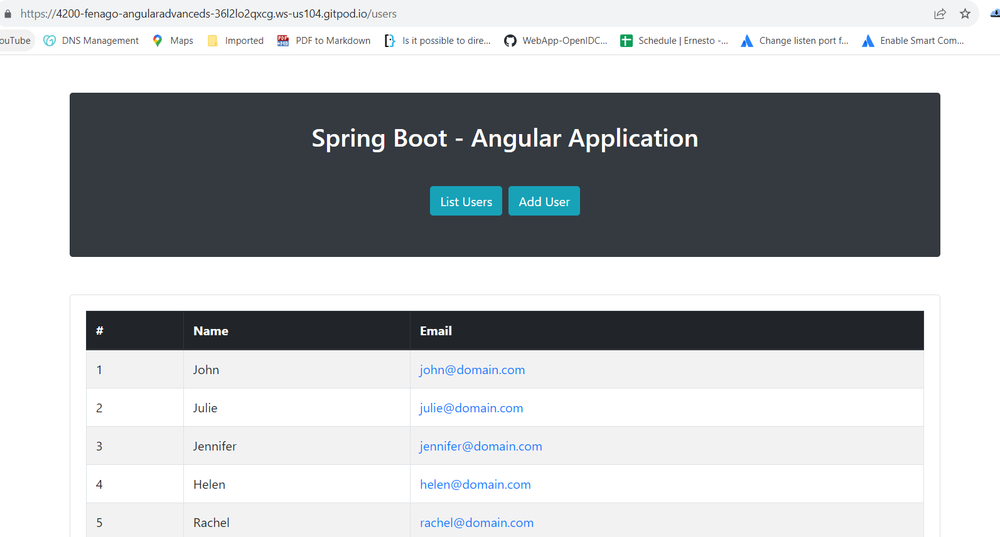

We should see the navigation bar with the buttons for listing existing
entities and for adding new ones. If we click the first button, we
should see below the navigation bar a table with the list of entities
persisted in the database:

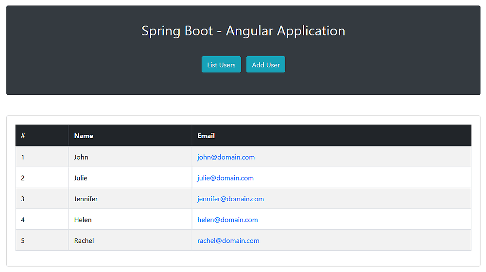

Similarly, clicking the second button will display the HTML form for
persisting a new entity:

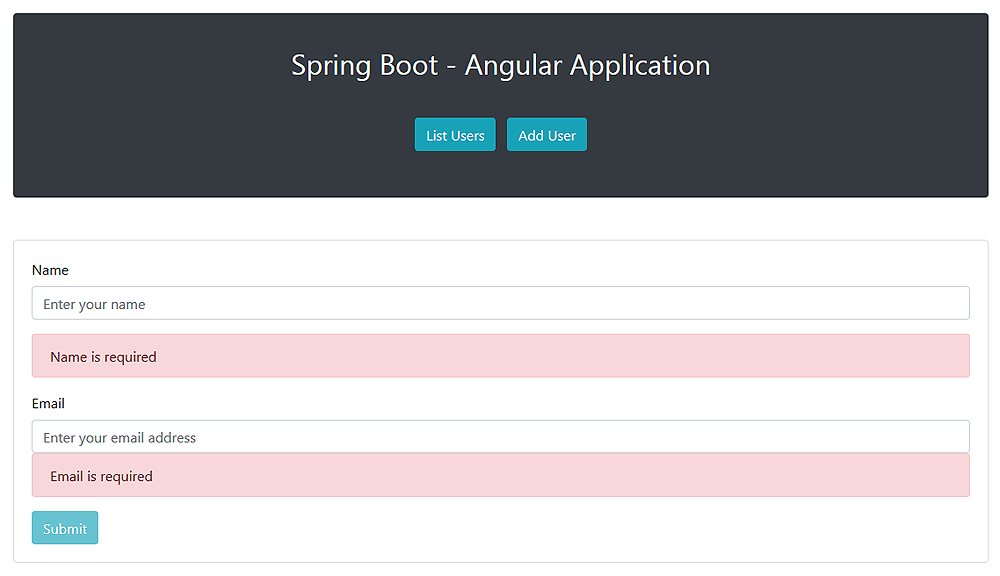


**5. Lab Solution**

Complete lab solution for this lab is also available in the lab environment:

**Run Spring Boot Server**

`Terminal 1`:

```
cd /workspace/angular-advanced-springboot/labs/lab1/application/

mvn spring-boot:run
```

**Run Angular Web Application**

Set `usersUrl` in the *user.service.ts* file. You can get URL like this:
`https://8080-YOUR_GITPOD_URL.gitpod.io/users`


`Terminal 2`:

```
cd /workspace/angular-advanced-springboot/labs/lab1/js/application/

npm install

ng serve --disable-host-check
```

Copy port 4200 URL from `PORTS` icon in the integrated terminal to access the application.

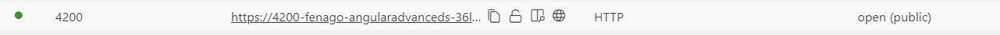


**6. Conclusion**

In this lab, we learned how to build a web application with Spring Boot and Angular.
