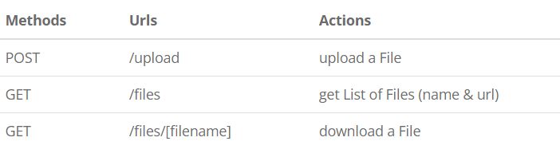
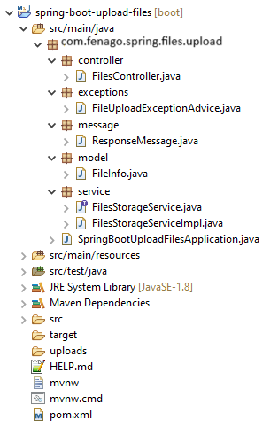
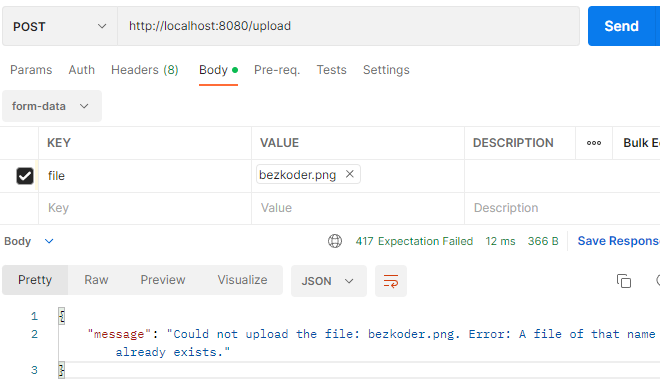

# Spring Boot File upload with Multipart File 

In this lab, I will show you how to upload and download files with
a Spring Boot Rest APIs to/from a static folder. We also use Spring Web
`MultipartFile` interface to handle HTTP
[multi-part](https://www.w3.org/Protocols/rfc1341/7_2_Multipart.html)
requests.


Contents

- Spring Boot Rest APIs for uploading Files
- Technology
- Project Structure
- Setup Spring Boot project
- Create Service for File Storage
- Define Data Models
- Define Response Message
- Create Controller for upload & download Files
- Configure Multipart File for Servlet
- Handle File Upload Exception
- Initialize Storage
- Run & Test
- Conclusion


### [Spring Boot Rest APIs for uploading Files]

Our Spring Boot Application will provide APIs for:

-   uploading File to a static folder in the Server
-   downloading File from server with the link
-   getting list of Files' information (file name & url)

These are APIs to be exported:



There is also the static folder that stores all uploaded files.

### [Technology]

-   Java 17
-   Spring Boot 3 / 2 (with Spring Web MVC)
-   Maven

### [Project Structure]




Let me explain it briefly.

-- `FileInfo` contains information of the uploaded file.\
-- `FilesStorageService` helps us to initialize storage, save new file,
load file, get list of Files' info, delete all files.\
-- `FilesController` uses `FilesStorageService` to export Rest APIs:
POST a file, GET all files' information, download a File.\
-- `FileUploadExceptionAdvice` handles exception when the controller
processes file upload.\
-- *application.properties* contains configuration for Servlet
Multipart.\
-- *uploads* is the static folder for storing files.\
-- *pom.xml* for Spring Boot dependency.


### Setup Spring Boot project

Starter project is available at following path for this lab:

```
cd /workspace/angular-advanced-springboot/labs/lab2/spring-boot-starter-upload-multipart-files

mvn install
```

 
### [Create Service for File Storage]

First we need an interface that will be autowired in the Controller.\
In *service* folder, create `FilesStorageService` interface like
following code:

*service/FilesStorageService.java*

```
package com.fenago.spring.files.upload.service;

import java.nio.file.Path;
import java.util.stream.Stream;

import org.springframework.core.io.Resource;
import org.springframework.web.multipart.MultipartFile;

public interface FilesStorageService {
  public void init();

  public void save(MultipartFile file);

  public Resource load(String filename);
  
  public boolean delete(String filename);

  public void deleteAll();

  public Stream<Path> loadAll();
}
```

Now we create implementation of the interface.


*service/FilesStorageServiceImpl.java*

```
package com.fenago.spring.files.upload.service;

import java.io.IOException;
import java.net.MalformedURLException;
import java.nio.file.FileAlreadyExistsException;
import java.nio.file.Files;
import java.nio.file.Path;
import java.nio.file.Paths;
import java.util.stream.Stream;

import org.springframework.core.io.Resource;
import org.springframework.core.io.UrlResource;
import org.springframework.stereotype.Service;
import org.springframework.util.FileSystemUtils;
import org.springframework.web.multipart.MultipartFile;

@Service
public class FilesStorageServiceImpl implements FilesStorageService {

  private final Path root = Paths.get("uploads");

  @Override
  public void init() {
    try {
      Files.createDirectories(root);
    } catch (IOException e) {
      throw new RuntimeException("Could not initialize folder for upload!");
    }
  }

  @Override
  public void save(MultipartFile file) {
    try {
      Files.copy(file.getInputStream(), this.root.resolve(file.getOriginalFilename()));
    } catch (Exception e) {
      if (e instanceof FileAlreadyExistsException) {
        throw new RuntimeException("A file of that name already exists.");
      }

      throw new RuntimeException(e.getMessage());
    }
  }

  @Override
  public Resource load(String filename) {
    try {
      Path file = root.resolve(filename);
      Resource resource = new UrlResource(file.toUri());

      if (resource.exists() || resource.isReadable()) {
        return resource;
      } else {
        throw new RuntimeException("Could not read the file!");
      }
    } catch (MalformedURLException e) {
      throw new RuntimeException("Error: " + e.getMessage());
    }
  }

  @Override
  public boolean delete(String filename) {
    try {
      Path file = root.resolve(filename);
      return Files.deleteIfExists(file);
    } catch (IOException e) {
      throw new RuntimeException("Error: " + e.getMessage());
    }
  }

  @Override
  public void deleteAll() {
    FileSystemUtils.deleteRecursively(root.toFile());
  }

  @Override
  public Stream<Path> loadAll() {
    try {
      return Files.walk(this.root, 1).filter(path -> !path.equals(this.root)).map(this.root::relativize);
    } catch (IOException e) {
      throw new RuntimeException("Could not load the files!");
    }
  }

}
```

### [Define Data Models]

Let's create `FileInfo` model which has fields: `name` & `url`.

*model/FileInfo.java*

```
package com.fenago.spring.files.upload.model;

public class FileInfo {
  private String name;
  private String url;

  public FileInfo(String name, String url) {
    this.name = name;
    this.url = url;
  }

  public String getName() {
    return this.name;
  }

  public void setName(String name) {
    this.name = name;
  }

  public String getUrl() {
    return this.url;
  }

  public void setUrl(String url) {
    this.url = url;
  }
}
```

### [Define Response Message]

The `ResponseMessage` is for message to client that we're gonna use in
Rest Controller and Exception Handler.

*message/ResponseMessage.java*

```
package com.fenago.spring.files.upload.message;

public class ResponseMessage {
  private String message;

  public ResponseMessage(String message) {
    this.message = message;
  }

  public String getMessage() {
    return message;
  }

  public void setMessage(String message) {
    this.message = message;
  }

}
```

### [Create Controller for upload & download Files]

In **controller** package, we create `FilesController`.

*controller/FilesController.java*

```
package com.fenago.spring.files.upload.controller;

import java.util.List;
import java.util.stream.Collectors;

import org.springframework.beans.factory.annotation.Autowired;
import org.springframework.core.io.Resource;
import org.springframework.http.HttpHeaders;
import org.springframework.http.HttpStatus;
import org.springframework.http.ResponseEntity;
import org.springframework.stereotype.Controller;
import org.springframework.web.bind.annotation.CrossOrigin;
import org.springframework.web.bind.annotation.DeleteMapping;
import org.springframework.web.bind.annotation.GetMapping;
import org.springframework.web.bind.annotation.PathVariable;
import org.springframework.web.bind.annotation.PostMapping;
import org.springframework.web.bind.annotation.RequestParam;
import org.springframework.web.multipart.MultipartFile;
import org.springframework.web.servlet.mvc.method.annotation.MvcUriComponentsBuilder;

import com.fenago.spring.files.upload.message.ResponseMessage;
import com.fenago.spring.files.upload.model.FileInfo;
import com.fenago.spring.files.upload.service.FilesStorageService;

@Controller
@CrossOrigin(origins = "*")
public class FilesController {

  @Autowired
  FilesStorageService storageService;

  @PostMapping("/upload")
  public ResponseEntity<ResponseMessage> uploadFile(@RequestParam("file") MultipartFile file) {
    String message = "";
    try {
      storageService.save(file);

      message = "Uploaded the file successfully: " + file.getOriginalFilename();
      return ResponseEntity.status(HttpStatus.OK).body(new ResponseMessage(message));
    } catch (Exception e) {
      message = "Could not upload the file: " + file.getOriginalFilename() + ". Error: " + e.getMessage();
      return ResponseEntity.status(HttpStatus.EXPECTATION_FAILED).body(new ResponseMessage(message));
    }
  }

  @GetMapping("/files")
  public ResponseEntity<List<FileInfo>> getListFiles() {
    List<FileInfo> fileInfos = storageService.loadAll().map(path -> {
      String filename = path.getFileName().toString();
      String url = MvcUriComponentsBuilder
          .fromMethodName(FilesController.class, "getFile", path.getFileName().toString()).build().toString();

      return new FileInfo(filename, url);
    }).collect(Collectors.toList());

    return ResponseEntity.status(HttpStatus.OK).body(fileInfos);
  }

  @GetMapping("/files/{filename:.+}")
  public ResponseEntity<Resource> getFile(@PathVariable String filename) {
    Resource file = storageService.load(filename);
    return ResponseEntity.ok()
        .header(HttpHeaders.CONTENT_DISPOSITION, "attachment; filename=\"" + file.getFilename() + "\"").body(file);
  }

  @DeleteMapping("/files/{filename:.+}")
  public ResponseEntity<ResponseMessage> deleteFile(@PathVariable String filename) {
    String message = "";
    
    try {
      boolean existed = storageService.delete(filename);
      
      if (existed) {
        message = "Delete the file successfully: " + filename;
        return ResponseEntity.status(HttpStatus.OK).body(new ResponseMessage(message));
      }
      
      message = "The file does not exist!";
      return ResponseEntity.status(HttpStatus.NOT_FOUND).body(new ResponseMessage(message));
    } catch (Exception e) {
      message = "Could not delete the file: " + filename + ". Error: " + e.getMessage();
      return ResponseEntity.status(HttpStatus.INTERNAL_SERVER_ERROR).body(new ResponseMessage(message));
    }
  }
}
```

-- `@CrossOrigin` is for configuring allowed origins.\
-- `@Controller` annotation is used to define a controller.\
-- `@GetMapping` and `@PostMapping` annotation is for mapping HTTP GET &
POST requests onto specific handler methods:

-   POST /upload: `uploadFile()`
-   GET /files: `getListFiles()`
-   GET /files/\[filename\]: `getFile()`

-- We use `@Autowired` to inject implementation of `FilesStorageService`
bean to local variable.

### [Configure Multipart File for Servlet]

Let's define the maximum file size that can be uploaded in
*application.properties* as following:

```
spring.servlet.multipart.max-file-size=500KB
spring.servlet.multipart.max-request-size=500KB
```

-- `spring.servlet.multipart.max-file-size`: max file size for each
request.\
-- `spring.servlet.multipart.max-request-size`: max request size for a
multipart/form-data.

### [Handle File Upload Exception]

This is where we handle the case in that a request exceeds Max Upload
Size. The system will throw `MaxUploadSizeExceededException` and we're
gonna use `@ControllerAdvice` with `@ExceptionHandler`annotation for
handling the exceptions.

*exception/FileUploadExceptionAdvice.java*

```
package com.fenago.spring.files.upload.exception;

import org.springframework.web.multipart.MaxUploadSizeExceededException;
import org.springframework.web.servlet.mvc.method.annotation.ResponseEntityExceptionHandler;

import com.fenago.spring.files.upload.message.ResponseMessage;

import org.springframework.http.HttpStatus;
import org.springframework.http.ResponseEntity;
import org.springframework.web.bind.annotation.ControllerAdvice;
import org.springframework.web.bind.annotation.ExceptionHandler;

@ControllerAdvice
public class FileUploadExceptionAdvice extends ResponseEntityExceptionHandler {

  @ExceptionHandler(MaxUploadSizeExceededException.class)
  public ResponseEntity<ResponseMessage> handleMaxSizeException(MaxUploadSizeExceededException exc) {
    return ResponseEntity.status(HttpStatus.EXPECTATION_FAILED).body(new ResponseMessage("File too large!"));
  }
}
```

### [Initialize Storage]

We need to run `init()` method of `FilesStorageService` (and also
`deleteAll()` if necessary). So open
*SpringBootUploadFilesApplication.java* and implement
`CommandLineRunner` for `run()` method like this:

```
package com.fenago.spring.files.upload;

// import javax.annotation.Resource; // for Spring Boot 2
import jakarta.annotation.Resource;

import org.springframework.boot.CommandLineRunner;
import org.springframework.boot.SpringApplication;
import org.springframework.boot.autoconfigure.SpringBootApplication;

import com.fenago.spring.files.upload.service.FilesStorageService;

@SpringBootApplication
public class SpringBootUploadFilesApplication implements CommandLineRunner {
  @Resource
  FilesStorageService storageService;

  public static void main(String[] args) {
    SpringApplication.run(SpringBootUploadFilesApplication.class, args);
  }

  @Override
  public void run(String... arg) throws Exception {
//    storageService.deleteAll();
    storageService.init();
  }
}
```

### Run & Test

Run Spring Boot application with command: `mvn spring-boot:run`.\
Refresh the project directory and you will see *uploads* folder inside
it.

Let's use **Postman** to make some requests. You will need to use Gitpod URL port 8080 to access the spring boot server:

`https://8080-YOUR_GITPOD_URL.gitpod.io`


-- Upload some files:


-- Upload a file with size larger than max file size (500KB):


-- Check **uploads** folder inside the sprign boot directory to see files.

-- Retrieve list of Files' information:

For example:  `https://8080-YOUR_GITPOD_URL.gitpod.io/files`

-- Now you can download any file from one of the paths above.

For example:  `https://8080-YOUR_GITPOD_URL.gitpod.io/files/YOUR_FILE_NAME`


-- If you upload a file that the file name already exists:





**Lab Solution**

Complete lab solution for this lab is also available in the lab environment. Run Spring Boot Server as shown below:

```
cd /workspace/angular-advanced-springboot/labs/lab2/spring-boot-upload-multipart-files

mvn spring-boot:run
```


**Conclusion**

In this lab, we've learned how to create Spring Boot File Upload Rest Api
Application to upload multipart files and get files information with
static folder via Restful API.

In the next lab, we will develop Angular frontend to upload files on spring boot server.
