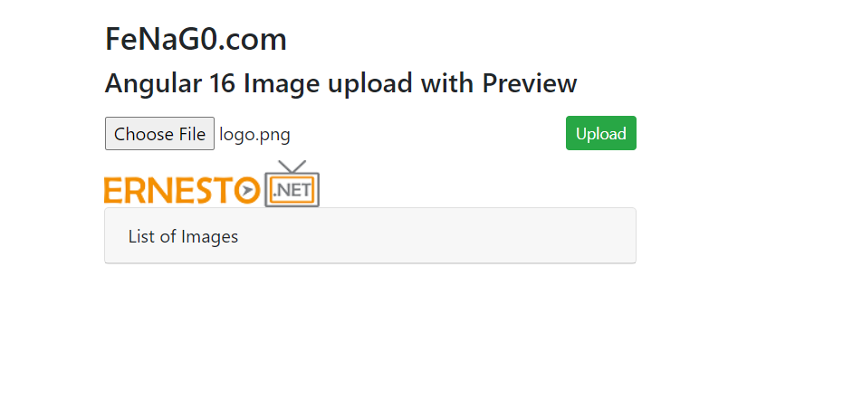
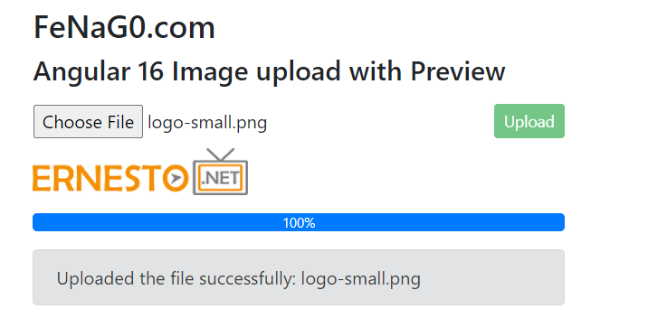
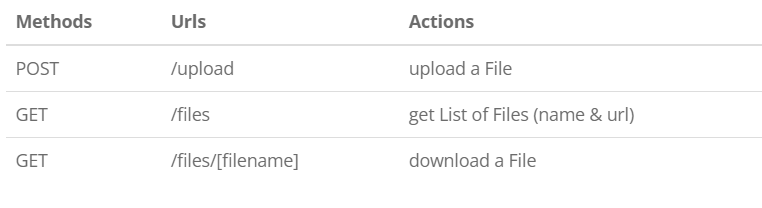
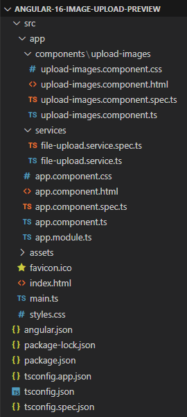
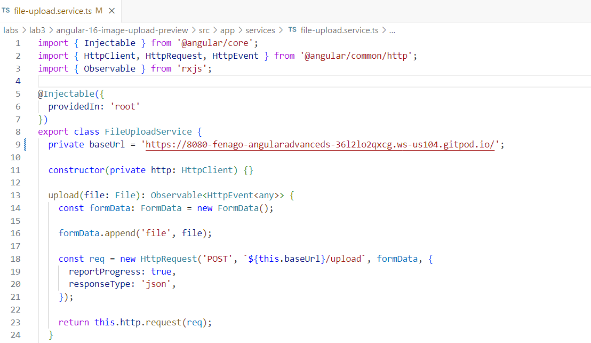
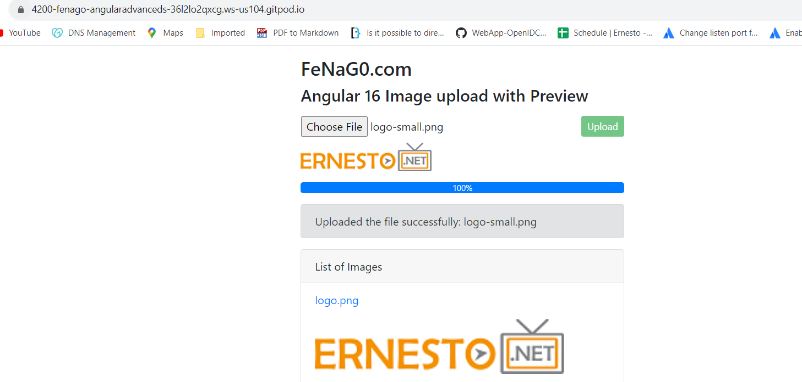

## Angular 16 Image Upload with Preview 


In this lab, I will show you way to build Image Upload with Preview
with Web API / Rest API using Angular 16, FormData and Bootstrap
Progress Bars.

- Overview
- Technology
- Rest API for Image Upload & Storage
- Setup Angular 16 Image Upload Preview Project
- Angular 16 Image upload with Preview example
- Set up App Module
- Add Bootstrap to the project
- Create Angular Service for Upload Files
- Create Angular 16 Component for Image Upload
- Add Image Upload Component to App Component
- Run the App

### [Overview]

We will create an Angular 16 Image upload with Preview application in
that user can:

-   upload only Image
-   see the preview of image that will be uploaded
-   see the upload process (percentage) of uploading image
-   view all uploaded images
-   download image by clicking on the file name

Here are screenshots of our Angular App:

-- Before upload:



-- When Image Upload is done:




-- List of Images Display with download Urls:


### [Technology]

-   Angular 16
-   RxJS 7
-   Bootstrap 4

### [Rest API for Image Upload & Storage]

Here are Rest APIs that we will use Axios to make HTTP requests:




### [Setup Angular 16 Image Upload Preview Project]

Let's open cmd and use Angular CLI to create a new Angular Project as
following command:

```
ng new angular-16-image-upload-preview
? Would you like to add Angular routing? No
? Which stylesheet format would you like to use? CSS
```

We also need to generate some Components and Services:


```
ng g s services/file-upload
ng g c components/image-upload
```

Now you can see that our project directory structure looks like this.

### [Angular 16 Image upload with Preview example]




Let me explain it briefly.

-- We import necessary library, components in *app.module.ts*.\
-- *file-upload.service* provides methods to save File and get Files
from Rest Apis Server.\
-- *image-upload.component* contains image upload form, preview,
progress bar, display list of images.\
-- *app.component* is the container that we embed all components.\
-- *index.html* / or *style.css* for importing the Bootstrap library

### [Set up App Module]

Open *app.module.ts* and import `HttpClientModule`:


```
import { NgModule } from '@angular/core';
import { BrowserModule } from '@angular/platform-browser';
import { HttpClientModule } from '@angular/common/http';

import { AppComponent } from './app.component';
import { ImageUploadComponent } from './components/image-upload/image-upload.component';

@NgModule({
  declarations: [
    AppComponent,
    ImageUploadComponent
  ],
  imports: [
    BrowserModule,
    HttpClientModule
  ],
  providers: [],
  bootstrap: [AppComponent]
})
export class AppModule { }
```

### [Add Bootstrap to the project]

Open *index.html* and add following line into `<head>` tag:

```
<!DOCTYPE html>
<html lang="en">
  <head>
    ...
    <link rel="stylesheet" href="https://unpkg.com/bootstrap@4.6.0/dist/css/bootstrap.min.css" />
  </head>
  ...
</html>
```

Another way is installing Bootstrap module with command:
`npm install bootstrap@4.6.2`.\
Then add following code into **src**/*style.css*:

```
@import "~bootstrap/dist/css/bootstrap.css";
```

### [Create Angular Service for Upload Files]

This service will use Angular `HttpClient` to send HTTP requests.\
There are 2 functions:

-   `upload(file)`: returns `Observable<HttpEvent<any>>` that we're
    gonna use for tracking progress
-   `getFiles()`: returns a list of Files' information as `Observable`
    object

**services**/*file-upload.service.ts*

```
import { Injectable } from '@angular/core';
import { HttpClient, HttpRequest, HttpEvent } from '@angular/common/http';
import { Observable } from 'rxjs';

@Injectable({
  providedIn: 'root'
})
export class FileUploadService {
  private baseUrl = 'ADD_SPRING_BOOT_URL_HERE';

  constructor(private http: HttpClient) {}

  upload(file: File): Observable<HttpEvent<any>> {
    const formData: FormData = new FormData();

    formData.append('file', file);

    const req = new HttpRequest('POST', `${this.baseUrl}/upload`, formData, {
      reportProgress: true,
      responseType: 'json',
    });

    return this.http.request(req);
  }

  getFiles(): Observable<any> {
    return this.http.get(`${this.baseUrl}/files`);
  }
}
```

-- `FormData` is a data structure that can be used to store key-value
pairs. We use it to build an object which corresponds to an HTML form
with `append()` method.

-- We set `reportProgress: true` to exposes progress events. Notice that
this progress event are expensive (change detection for each event), so
you should only use when you want to monitor it.


-- We call the `request(PostRequest)` & `get()` method of `HttpClient`
to send an HTTP POST & Get request to the Multiple Files Upload Rest
server.

### [Create Angular 16 Component for Image Upload]

Let's create Image Upload UI with Preview, Progress Bars, Card, Button
and Message.

First we need to use the following imports:

*image-upload.component.ts*

```
import { Component, OnInit } from '@angular/core';
import { HttpEventType, HttpResponse } from '@angular/common/http';
import { Observable } from 'rxjs';
import { FileUploadService } from 'src/app/services/file-upload.service';
```

Then we define the some variables and inject `FileUploadService` as
follows:

```
@Component({
  selector: 'app-image-upload',
  templateUrl: './image-upload.component.html',
  styleUrls: ['./image-upload.component.css']
})
export class ImageUploadComponent implements OnInit {
  selectedFiles?: FileList;
  currentFile?: File;
  progress = 0;
  message = '';
  preview = '';

  imageInfos?: Observable<any>;

  constructor(private uploadService: FileUploadService) {}
}
```

The `progress` is variable for display upload progress of uploading
image.

Next we define `selectFiles()` method. It helps us to get the selected
Image that we're gonna upload.

```
selectFile(event: any): void {
  this.message = '';
  this.preview = '';
  this.progress = 0;
  this.selectedFiles = event.target.files;

  if (this.selectedFiles) {
    const file: File | null = this.selectedFiles.item(0);

    if (file) {
      this.preview = '';
      this.currentFile = file;

      const reader = new FileReader();

      reader.onload = (e: any) => {
        console.log(e.target.result);
        this.preview = e.target.result;
      };

      reader.readAsDataURL(this.currentFile);
    }
  }
}
```

Firstly, we use `selectedFiles` array for accessing current selected
Files and get the first item for current file only.

We use `FileReader` with `readAsDataURL()` method to get the image
preview URL and `reader.onload()` to put it into `preview` variable.

The `readAsDataURL()` method produces data as a [data:
URL](https://developer.mozilla.org/en-US/docs/Web/HTTP/Basics_of_HTTP/Data_URIs)
representing the file's data as a base64 encoded string. The URL life is
tied to the document in the window on which it was created.

Now we define `upload()` method for uploading the selected image:

```
upload(): void {
  this.progress = 0;

  if (this.selectedFiles) {
    const file: File | null = this.selectedFiles.item(0);

    if (file) {
      this.currentFile = file;

      this.uploadService.upload(this.currentFile).subscribe({
        next: (event: any) => {
          if (event.type === HttpEventType.UploadProgress) {
            this.progress = Math.round((100 * event.loaded) / event.total);
          } else if (event instanceof HttpResponse) {
            this.message = event.body.message;
            this.imageInfos = this.uploadService.getFiles();
          }
        },
        error: (err: any) => {
          console.log(err);
          this.progress = 0;

          if (err.error && err.error.message) {
            this.message = err.error.message;
          } else {
            this.message = 'Could not upload the image!';
          }

          this.currentFile = undefined;
        },
      });
    }

    this.selectedFiles = undefined;
  }
}
```

The progress (percentage of the upload process) will be calculated
basing on `event.loaded` and `event.total`.\
If the transmission is done, the event will be a `HttpResponse` object.
At this time, we call `uploadService.getFiles()` to get the files'
information and assign the result to `imageInfos` variable.

We also need to do this work in `ngOnInit()` method:

```
ngOnInit(): void {
  this.imageInfos = this.uploadService.getFiles();
}
```

Now we create the HTML template of the Image Upload with Preview UI.\
Add the following content to *image-upload.component.html* file:

```
<div class="row">
  <div class="col-8">
    <label class="btn btn-default p-0">
      <input type="file" accept="image/*" (change)="selectFile($event)" />
    </label>
  </div>

  <div class="col-4">
    <button
      class="btn btn-success btn-sm float-right"
      [disabled]="!selectedFiles"
      (click)="upload()"
    >
      Upload
    </button>
  </div>
</div>

<div>
  
</div>

<div *ngIf="currentFile && progress" class="progress my-3">
  <div
    class="progress-bar progress-bar-info"
    role="progressbar"
    attr.aria-valuenow="{{ progress }}"
    aria-valuemin="0"
    aria-valuemax="100"
    [ngStyle]="{ width: progress + '%' }"
  >
    {{ progress }}%
  </div>
</div>

<div *ngIf="message" class="alert alert-secondary" role="alert">
  {{ message }}
</div>

<div class="card mt-3">
  <div class="card-header">List of Images</div>
  <ul class="list-group list-group-flush">
    <li *ngFor="let image of imageInfos | async" class="list-group-item">
      <p><a href="{{ image.url }}">{{ image.name }}</a></p>
      
    </li>
  </ul>
</div>
```

*upload-images.component.css*

```
.preview {
  max-width: 200px;
}
```

### [Add Image Upload Component to App Component]

Open *app.component.html* and embed the Upload Images Component with
`<app-image-upload>` tag.

```
<div class="container" style="width:500px">
  <div class="my-3">
    <h3>FeNaG0.com</h3>
    <h4>{{ title }}</h4>
  </div>

  <app-image-upload></app-image-upload>
</div>
```

*app.component.ts*

```
import { Component } from '@angular/core';

@Component({
  selector: 'app-root',
  templateUrl: './app.component.html',
  styleUrls: ['./app.component.css']
})
export class AppComponent {
  title = 'Angular 16 Image upload with Preview';
}
```

### Run the App

You need run with port `4200` with command:

`ng serve --disable-host-check --port 4200`

Open Browser with Gitpod url on port `4200` and check the result.


**Lab Solution**

Complete lab solution for this lab is also available in the lab environment. Run Angular Web Application as shown below:

Set `baseUrl` in the *src/app/services/file-upload.service.ts* file. You can get URL like this:

`https://8080-YOUR_GITPOD_URL.gitpod.io`




```
cd /workspace/angular-advanced-springboot/labs/lab3/angular-16-image-upload-preview/

npm install

ng serve --disable-host-check
```

Copy port `4200` URL from `PORTS` icon in the integrated terminal to access the application.


