## Spring Boot JPA + H2: Build a CRUD Rest APIs 

In this lab, we're gonna build a Spring Boot Rest CRUD API
with Maven that use Spring Data JPA to interact with H2 database. You'll
know:

-   How to configure Spring Data, JPA, Hibernate to work with Database
-   How to define Data Models and Repository interfaces
-   Way to create Spring Rest Controller to process HTTP requests
-   Way to use Spring Data JPA to interact with H2 Database


**Overview of Spring Boot JPA + H2**

- Technology
- Project Structure
- Create & Setup Spring Boot project
- Configure Spring Boot, JPA, h2, Hibernate
- Define Data Model
- Create Repository Interface
- Create Spring Rest APIs Controller
- Run & Test
- Conclusion

### Overview of Spring Boot JPA + H2

We will build a Spring Boot Rest Apis using Spring Data JPA with H2
Database for a Tutorial application in that:

-   Each Tutorial has id, title, description, published status.
-   Apis help to create, retrieve, update, delete Tutorials.
-   Apis also support custom finder methods such as find by published
    status or by title.

These are APIs that we need to provide:

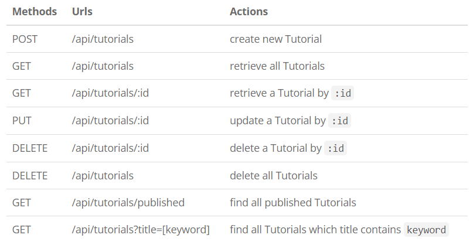

-- We make CRUD operations & finder methods with Spring Data JPA's
`JpaRepository`.\
-- The database will be H2 Database (in memory or on disk) by
configuring project dependency & datasource.

### [Technology]

-   Java 17
-   Spring Boot 3 / 2 (with Spring Web MVC, Spring Data JPA)
-   H2 Database
-   Maven

### [Project Structure]

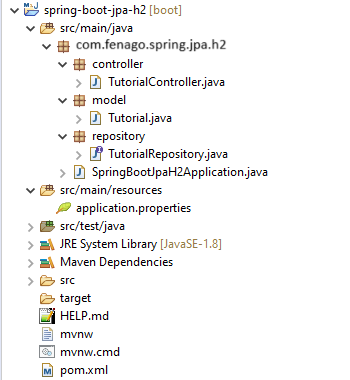

Let me explain it briefly.


-- `Tutorial` data model class corresponds to entity and table
*tutorials*.\
-- `TutorialRepository` is an interface that extends
[JpaRepository](https://docs.spring.io/spring-data/jpa/docs/current/api/org/springframework/data/jpa/repository/JpaRepository.html)
for CRUD methods and custom finder methods. It will be autowired in
`TutorialController`.\
-- `TutorialController` is a
[RestController](https://docs.spring.io/spring/docs/current/javadoc-api/org/springframework/web/bind/annotation/RestController.html)
which has request mapping methods for RESTful requests such as:
*getAllTutorials*, *createTutorial*, *updateTutorial*, *deleteTutorial*,
*findByPublished*...\
-- Configuration for Spring Datasource, JPA & Hibernate in
**application.properties**.\
-- **pom.xml** contains dependencies for Spring Boot and H2 Database.


### Setup Spring Boot project

Starter project is available at following path for this lab:

```
cd /workspace/angular-advanced-springboot/labs/lab4/spring-boot-starter-h2-database-crud/

mvn install
```
 


### [Configure Spring Boot, JPA, h2, Hibernate]

Under **src**/**main**/**resources** folder, open
*application.properties* and write these lines.

```
spring.h2.console.enabled=true
# default path: h2-console
spring.h2.console.path=/h2-ui
spring.h2.console.settings.web-allow-others=true
 
spring.datasource.url=jdbc:h2:file:./testdb
spring.datasource.driverClassName=org.h2.Driver
spring.datasource.username=sa
spring.datasource.password=
 
spring.jpa.show-sql=true
spring.jpa.properties.hibernate.dialect=org.hibernate.dialect.H2Dialect
spring.jpa.hibernate.ddl-auto= update
```

-   `spring.datasource.url`: `jdbc:h2:mem:[database-name]` for In-memory
    database and `jdbc:h2:file:[path/database-name]` for disk-based
    database.
-   `spring.datasource.username` & `spring.datasource.password`
    properties are the same as your database installation.
-   Spring Boot uses Hibernate for JPA implementation, we configure
    `H2Dialect` for H2 Database
-   `spring.jpa.hibernate.ddl-auto` is used for database initialization.
    We set the value to `update` value so that a table will be created
    in the database automatically corresponding to defined data model.
    Any change to the model will also trigger an update to the table.
    For production, this property should be `validate`.
-   `spring.h2.console.enabled=true` tells the Spring to start H2
    Database administration tool and you can access this tool on the
    browser: `https://8080-Gitpod_URL/h2-console`.
-   `spring.h2.console.path=/h2-ui` is for H2 console's url, so the
    default url `https://8080-Gitpod_URL/h2-console` will change to
    `https://8080-Gitpod_URL/h2-ui`.

### [Define Data Model]

Our Data model is Tutorial with four fields: id, title, description,
published.\
In **model** package, we define `Tutorial` class.

*model/Tutorial.java*

```
package com.fenago.spring.jpa.h2.model;

import jakarta.persistence.*;

@Entity
@Table(name = "tutorials")
public class Tutorial {

  @Id
  @GeneratedValue(strategy = GenerationType.AUTO)
  private long id;

  @Column(name = "title")
  private String title;

  @Column(name = "description")
  private String description;

  @Column(name = "published")
  private boolean published;

  public Tutorial() {

  }

  public Tutorial(String title, String description, boolean published) {
    this.title = title;
    this.description = description;
    this.published = published;
  }

  public long getId() {
    return id;
  }

  public String getTitle() {
    return title;
  }

  public void setTitle(String title) {
    this.title = title;
  }

  public String getDescription() {
    return description;
  }

  public void setDescription(String description) {
    this.description = description;
  }

  public boolean isPublished() {
    return published;
  }

  public void setPublished(boolean isPublished) {
    this.published = isPublished;
  }

  @Override
  public String toString() {
    return "Tutorial [id=" + id + ", title=" + title + ", desc=" + description + ", published=" + published + "]";
  }

}
```

-- `@Entity` annotation indicates that the class is a persistent Java
class.\
-- `@Table` annotation provides the table that maps this entity.\
-- `@Id` annotation is for the primary key.\
-- `@GeneratedValue` annotation is used to define generation strategy
for the primary key. `GenerationType.AUTO` means Auto Increment field.\
-- `@Column` annotation is used to define the column in database that
maps annotated field.

### [Create Repository Interface]

Let's create a repository to interact with Tutorials from the database.\
In **repository** package, create `TutorialRepository` interface that
extends `JpaRepository`.

*repository/TutorialRepository.java*

```
package com.fenago.spring.jpa.h2.repository;

import java.util.List;

import org.springframework.data.jpa.repository.JpaRepository;

import com.fenago.spring.jpa.h2.model.Tutorial;

public interface TutorialRepository extends JpaRepository<Tutorial, Long> {
  List<Tutorial> findByPublished(boolean published);

  List<Tutorial> findByTitleContainingIgnoreCase(String title);
}
```

Now we can use JpaRepository's methods: `save()`, `findOne()`,
`findById()`, `findAll()`, `count()`, `delete()`, `deleteById()`...
without implementing these methods.

We also define custom finder methods:
-- `findByPublished()`: returns all Tutorials with `published` having
value as input `published`.\
-- `findByTitleContaining()`: returns all Tutorials which title contains
input `title`.


### [Create Spring Rest APIs Controller]

Finally, we create a controller that provides APIs for creating,
retrieving, updating, deleting and finding Tutorials.

*controller/TutorialController.java*

```
package com.fenago.spring.jpa.h2.controller;

import java.util.ArrayList;
import java.util.List;
import java.util.Optional;

import org.springframework.beans.factory.annotation.Autowired;
import org.springframework.http.HttpStatus;
import org.springframework.http.ResponseEntity;
import org.springframework.web.bind.annotation.CrossOrigin;
import org.springframework.web.bind.annotation.DeleteMapping;
import org.springframework.web.bind.annotation.GetMapping;
import org.springframework.web.bind.annotation.PathVariable;
import org.springframework.web.bind.annotation.PostMapping;
import org.springframework.web.bind.annotation.PutMapping;
import org.springframework.web.bind.annotation.RequestBody;
import org.springframework.web.bind.annotation.RequestMapping;
import org.springframework.web.bind.annotation.RequestParam;
import org.springframework.web.bind.annotation.RestController;

import com.fenago.spring.jpa.h2.model.Tutorial;
import com.fenago.spring.jpa.h2.repository.TutorialRepository;

@CrossOrigin(origins = "*")
@RestController
@RequestMapping("/api")
public class TutorialController {

  @Autowired
  TutorialRepository tutorialRepository;

  @GetMapping("/tutorials")
  public ResponseEntity<List<Tutorial>> getAllTutorials(@RequestParam(required = false) String title) {
    try {
      List<Tutorial> tutorials = new ArrayList<Tutorial>();

      if (title == null)
        tutorialRepository.findAll().forEach(tutorials::add);
      else
        tutorialRepository.findByTitleContainingIgnoreCase(title).forEach(tutorials::add);

      if (tutorials.isEmpty()) {
        return new ResponseEntity<>(HttpStatus.NO_CONTENT);
      }

      return new ResponseEntity<>(tutorials, HttpStatus.OK);
    } catch (Exception e) {
      return new ResponseEntity<>(null, HttpStatus.INTERNAL_SERVER_ERROR);
    }
  }

  @GetMapping("/tutorials/{id}")
  public ResponseEntity<Tutorial> getTutorialById(@PathVariable("id") long id) {
    Optional<Tutorial> tutorialData = tutorialRepository.findById(id);

    if (tutorialData.isPresent()) {
      return new ResponseEntity<>(tutorialData.get(), HttpStatus.OK);
    } else {
      return new ResponseEntity<>(HttpStatus.NOT_FOUND);
    }
  }

  @PostMapping("/tutorials")
  public ResponseEntity<Tutorial> createTutorial(@RequestBody Tutorial tutorial) {
    try {
      Tutorial _tutorial = tutorialRepository.save(new Tutorial(tutorial.getTitle(), tutorial.getDescription(), false));
      return new ResponseEntity<>(_tutorial, HttpStatus.CREATED);
    } catch (Exception e) {
      return new ResponseEntity<>(null, HttpStatus.INTERNAL_SERVER_ERROR);
    }
  }

  @PutMapping("/tutorials/{id}")
  public ResponseEntity<Tutorial> updateTutorial(@PathVariable("id") long id, @RequestBody Tutorial tutorial) {
    Optional<Tutorial> tutorialData = tutorialRepository.findById(id);

    if (tutorialData.isPresent()) {
      Tutorial _tutorial = tutorialData.get();
      _tutorial.setTitle(tutorial.getTitle());
      _tutorial.setDescription(tutorial.getDescription());
      _tutorial.setPublished(tutorial.isPublished());
      return new ResponseEntity<>(tutorialRepository.save(_tutorial), HttpStatus.OK);
    } else {
      return new ResponseEntity<>(HttpStatus.NOT_FOUND);
    }
  }

  @DeleteMapping("/tutorials/{id}")
  public ResponseEntity<HttpStatus> deleteTutorial(@PathVariable("id") long id) {
    try {
      tutorialRepository.deleteById(id);
      return new ResponseEntity<>(HttpStatus.NO_CONTENT);
    } catch (Exception e) {
      return new ResponseEntity<>(HttpStatus.INTERNAL_SERVER_ERROR);
    }
  }

  @DeleteMapping("/tutorials")
  public ResponseEntity<HttpStatus> deleteAllTutorials() {
    try {
      tutorialRepository.deleteAll();
      return new ResponseEntity<>(HttpStatus.NO_CONTENT);
    } catch (Exception e) {
      return new ResponseEntity<>(HttpStatus.INTERNAL_SERVER_ERROR);
    }

  }

  @GetMapping("/tutorials/published")
  public ResponseEntity<List<Tutorial>> findByPublished() {
    try {
      List<Tutorial> tutorials = tutorialRepository.findByPublished(true);

      if (tutorials.isEmpty()) {
        return new ResponseEntity<>(HttpStatus.NO_CONTENT);
      }
      return new ResponseEntity<>(tutorials, HttpStatus.OK);
    } catch (Exception e) {
      return new ResponseEntity<>(HttpStatus.INTERNAL_SERVER_ERROR);
    }
  }

}
```

-- `@CrossOrigin` is for configuring allowed origins.\
-- `@RestController` annotation is used to define a controller and to
indicate that the return value of the methods should be be bound to the
web response body.\
-- `@RequestMapping("/api")` declares that all Apis' url in the
controller will start with `/api`.\
-- We use `@Autowired` to inject `TutorialRepository` bean to local
variable.


### Run & Test

Run Spring Boot application with command: `mvn spring-boot:run`.

***tutorials*** table will be automatically generated in Database.

Let's open H2 console with url: `https://8080-Gitpod_URL/h2-ui`:

**IMPORTANT:** Enter `jdbc:h2:file:./testdb` in JDBC URL field and click `Test Connection` to confirm connectivity:

-- For on Disk database:

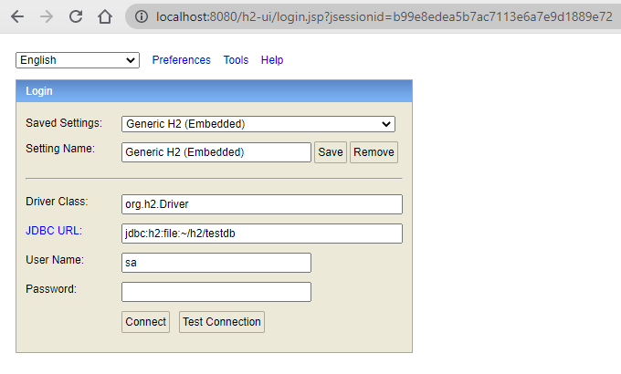


Note: If you are using In-memory database, you can connect like this:


Click on **Connect** button, then check H2 database, you can see things
like this:


Create some Tutorials:

**Note:** You will connect using Gitpod URL on port `8080`.

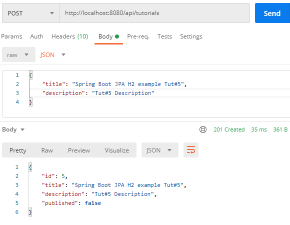


H2 database `tutorials` table after that:

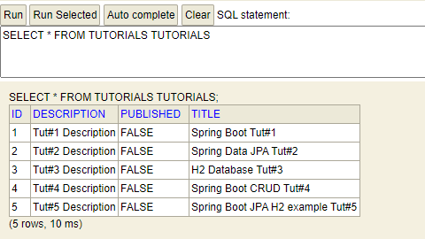


Update some Tutorials:

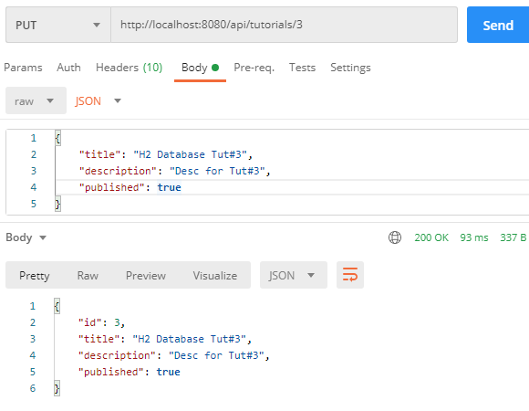


The table data is changed:

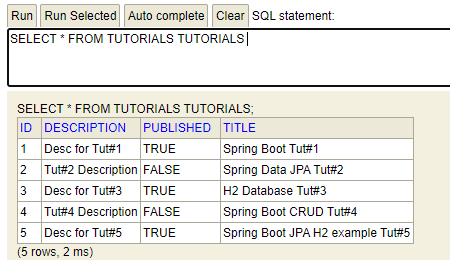

Retrieve all Tutorials:

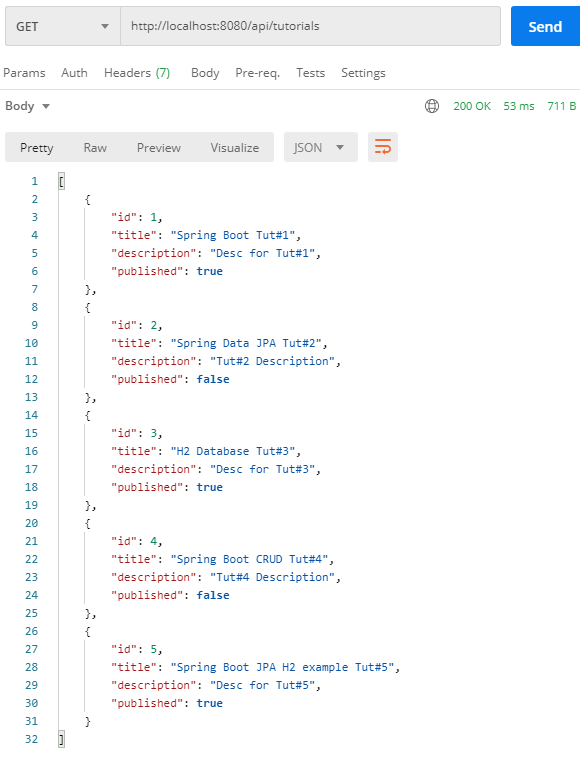

Retrieve a Tutorial by Id:

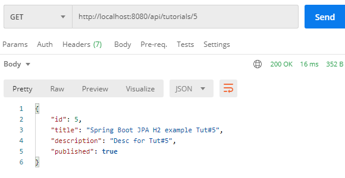

Find all ***published*** Tutorials:

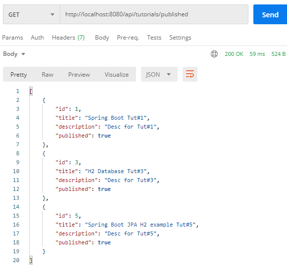


Find all Tutorials which title contains string 'ot':

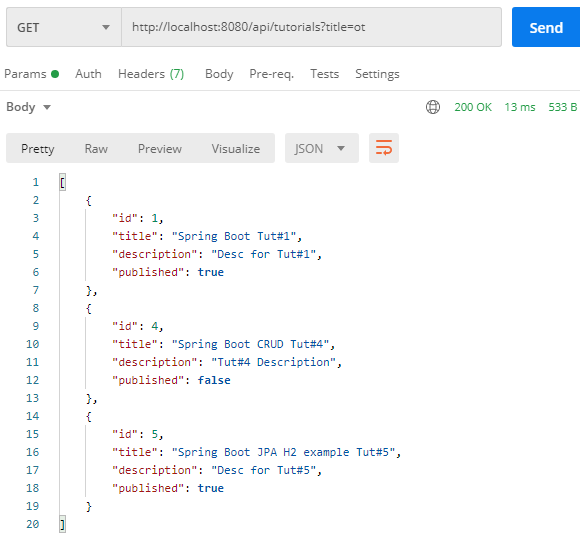


Delete a Tutorial:

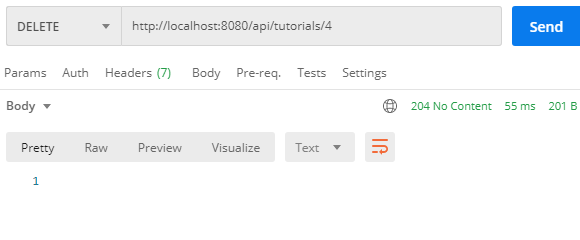

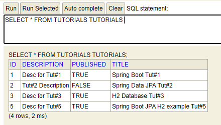


Delete all Tutorials:

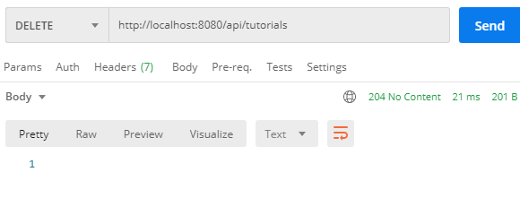


H2 database table is clean now:

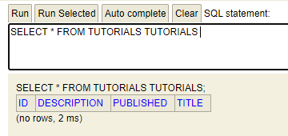


**Lab Solution**

Complete lab solution for this lab is also available in the lab environment. Run Spring Boot Server as shown below:

```
cd /workspace/angular-advanced-springboot/labs/lab4/spring-boot-h2-database-crud/

mvn spring-boot:run
```

**Conclusion**

In this lab, we've built a Rest CRUD API using Spring Boot, Spring Data JPA
working with H2 Database.

We also see that `JpaRepository` supports a great way to make CRUD
operations and custom finder methods without need of boilerplate code.

In the next lab, we will develop Angular frontend that connects with spring boot server.
