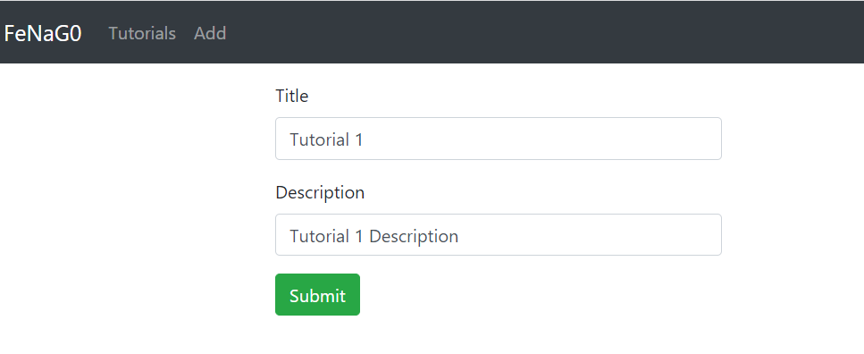
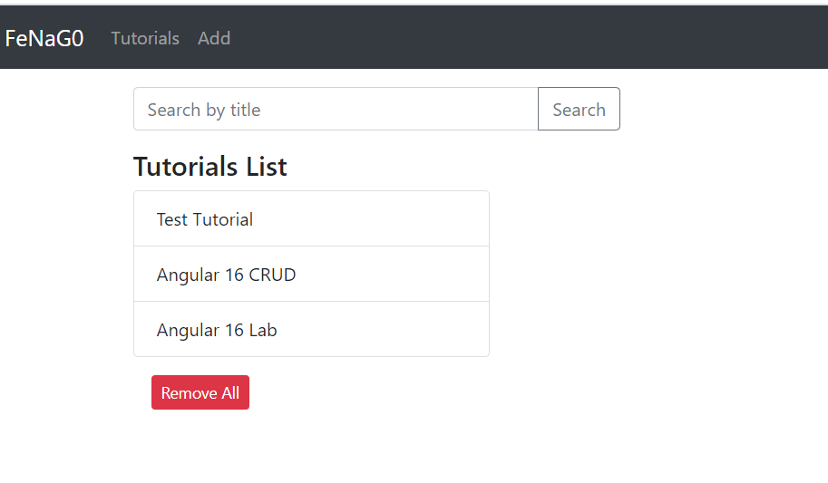
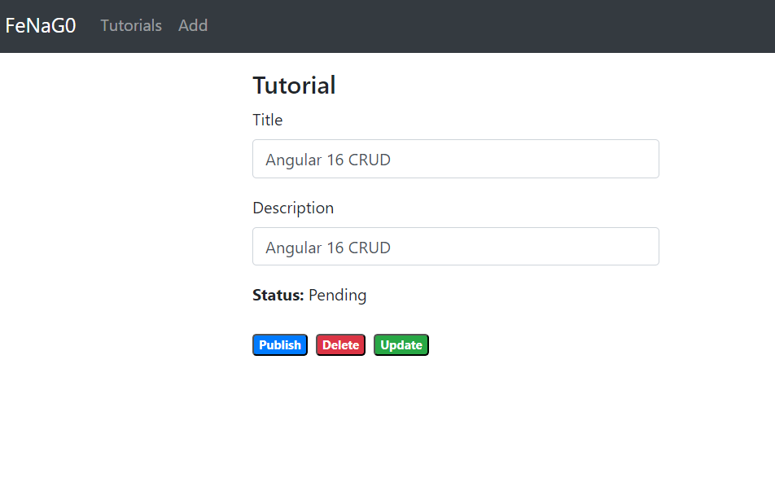
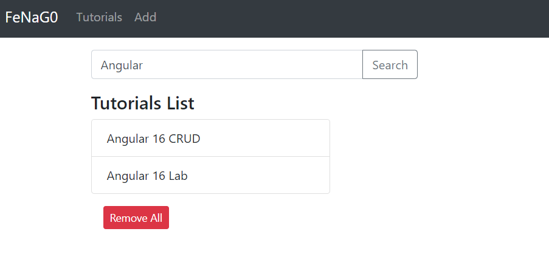
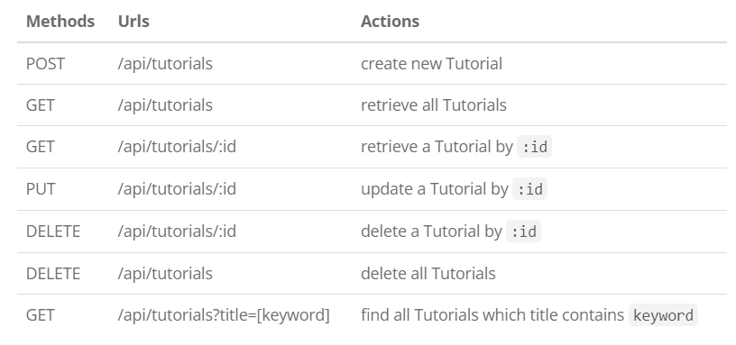
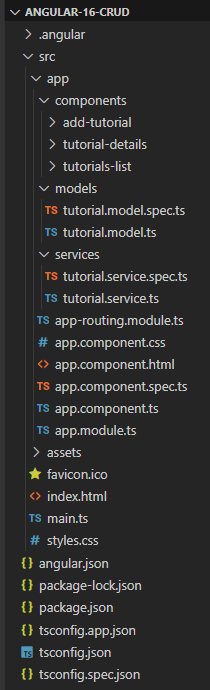
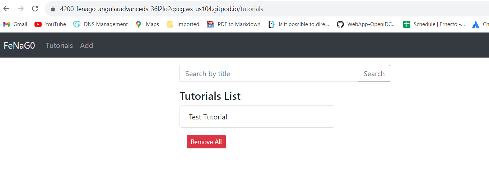

## Angular 16 CRUD with Web API

In this lab, I will show you how to build an Angular 16
project with CRUD Application to consume Rest API, display, modify &
search data using HttpClient, Forms and Router.


Contents

- Overview
- Rest API
- Technology
- Angular 16 Component Diagram
- Setup Angular 16 Project
- Project Structure
- Set up App Module
- Define Routes for Angular AppRoutingModule
- Import Bootstrap
- Add Navbar and Router View
- Define Model Class
- Create Data Service
- Create Angular Components
- Add new Item Component
- List of items Component
- Item details Component
- Run the Angular 16 CRUD

### Overview of Angular 16 CRUD

We will build an Angular 16 project -- CRUD Tutorial Application
in that:

-   Each Tutorial has id, title, description, published status.
-   We can create, retrieve, update, delete Tutorials.
-   There is a Search bar for finding Tutorials by title.

Here are screenshots of our Angular 16 CRUD Application.

-- Create a Tutorial:



-- Retrieve Tutorials:



-- Click on **Edit** button to update an object:




On this Page, you can:


-   change status to **Published** using **Publish** button
-   delete the Tutorial using **Delete** button
-   update the Tutorial details with **Update** button


-- Search Tutorials by title:




### Rest API

The introduction above is for Angular Client with assumption that we
have a Server exporting REST APIs:




### [Technology]

-   Angular 16
-   RxJS 7
-   Bootstrap 4

### [Angular 16 CRUD App Component Diagram]


-- The `App` component is a container with `router-outlet`. It has
navbar that links to routes paths via `routerLink`.

-- `TutorialsList` component gets and displays Tutorials.\
-- `TutorialDetails` component has form for editing Tutorial's details
based on `:id`.\
-- `AddTutorial` component has form for submission new Tutorial.

-- These Components call `TutorialService` methods which use Angular
`HttpClient` to make HTTP requests and receive responses.

### [Setup Angular 16 Project]

Let's open cmd and use Angular CLI to create a new Angular Project as
following command:

```
ng new angular-16-crud
? Would you like to add Angular routing? Yes
? Which stylesheet format would you like to use? CSS
```

We also need to generate some Components and Services:

```
ng g class models/tutorial --type=model

ng g c components/add-tutorial
ng g c components/tutorial-details
ng g c components/tutorials-list

ng g s services/tutorial
```

Now you can see that our project directory structure looks like this.

### [Project Structure]



Let me explain it briefly.

-- `tutorial.model.ts` exports the main class model: `Tutorial`.\
-- There are 3 components: `tutorials-list`, `tutorial-details`,
`add-tutorial`.\
-- `tutorial.service` has methods for sending HTTP requests to the
Apis.\
-- `app-routing.module.ts` defines routes for each component.\
-- `app` component contains router view and navigation bar.\
-- `app.module.ts` declares Angular components and import necessary
modules.\
-- `style.css` contains import for Bootstrap file.

### [Set up App Module]

Open *app.module.ts* and import `FormsModule`, `HttpClientModule`:

```
...
import { FormsModule } from '@angular/forms';
import { HttpClientModule } from '@angular/common/http';

@NgModule({
  declarations: [ ... ],
  imports: [
    ...
    FormsModule,
    HttpClientModule
  ],
  providers: [],
  bootstrap: [AppComponent]
})
export class AppModule { }
```

### [Define Routes for Angular 16 CRUD]

There are 3 main routes:

-- `/tutorials` for `tutorials-list` component\
-- `/tutorials/:id` for `tutorial-details` component\
-- `/add` for `add-tutorial` component

*app-routing.module.ts*

```
import { NgModule } from '@angular/core';
import { RouterModule, Routes } from '@angular/router';
import { TutorialsListComponent } from './components/tutorials-list/tutorials-list.component';
import { TutorialDetailsComponent } from './components/tutorial-details/tutorial-details.component';
import { AddTutorialComponent } from './components/add-tutorial/add-tutorial.component';

const routes: Routes = [
  { path: '', redirectTo: 'tutorials', pathMatch: 'full' },
  { path: 'tutorials', component: TutorialsListComponent },
  { path: 'tutorials/:id', component: TutorialDetailsComponent },
  { path: 'add', component: AddTutorialComponent }
];

@NgModule({
  imports: [RouterModule.forRoot(routes)],
  exports: [RouterModule]
})
export class AppRoutingModule { }
```

### [Import Bootstrap into Angular 16 Project]

Run the command: `npm install bootstrap@4.6.2`.

Next, open **src**/*style.css* and add following code:

```
@import "~bootstrap/dist/css/bootstrap.css";
```

### [Add Navbar and Router View to Angular 16 CRUD]

Let's open **src**/*app.component.html*, this `App` component is the
root container for our application, it will contain a `nav` element.

```
<div>
  <nav class="navbar navbar-expand navbar-dark bg-dark">
    <a href="#" class="navbar-brand">FeNaG0</a>
    <div class="navbar-nav mr-auto">
      <li class="nav-item">
        <a routerLink="tutorials" class="nav-link">Tutorials</a>
      </li>
      <li class="nav-item">
        <a routerLink="add" class="nav-link">Add</a>
      </li>
    </div>
  </nav>

  <div class="container mt-3">
    <router-outlet></router-outlet>
  </div>
</div>
```

### [Define Model Class]

Our main model class `Tutorial` will be exported in *tutorial.model.ts*
with 4 fields:

-   `id`
-   `title`
-   `description`
-   `published`

**models**/*tutorial.model.ts*

```
export class Tutorial {
  id?: any;
  title?: string;
  description?: string;
  published?: boolean;
}
```

### [Create Data Service]

This service will use Angular `HTTPClient` to send HTTP requests.\
You can see that its functions includes CRUD operations and finder
method.

**services**/*tutorial.service.ts*

```
import { Injectable } from '@angular/core';
import { HttpClient } from '@angular/common/http';
import { Observable } from 'rxjs';
import { Tutorial } from '../models/tutorial.model';

const baseUrl = 'ADD_SPRING_BOOT_URL_HERE/api/tutorials';

@Injectable({
  providedIn: 'root'
})
export class TutorialService {

  constructor(private http: HttpClient) { }

  getAll(): Observable<Tutorial[]> {
    return this.http.get<Tutorial[]>(baseUrl);
  }

  get(id: any): Observable<Tutorial> {
    return this.http.get<Tutorial>(`${baseUrl}/${id}`);
  }

  create(data: any): Observable<any> {
    return this.http.post(baseUrl, data);
  }

  update(id: any, data: any): Observable<any> {
    return this.http.put(`${baseUrl}/${id}`, data);
  }

  delete(id: any): Observable<any> {
    return this.http.delete(`${baseUrl}/${id}`);
  }

  deleteAll(): Observable<any> {
    return this.http.delete(baseUrl);
  }

  findByTitle(title: any): Observable<Tutorial[]> {
    return this.http.get<Tutorial[]>(`${baseUrl}?title=${title}`);
  }
}
```

### [Create Angular 16 Components]

As you've known before, there are 3 components corresponding to 3 routes
defined in `AppRoutingModule`.

#### [Add new Item Component]

This component has a Form to submit new Tutorial with 2 fields: `title`
& `description`. It calls `TutorialService.create()` method.

**components**/**add-tutorial**/*add-tutorial.component.ts*

```
import { Component, OnInit } from '@angular/core';
import { Tutorial } from 'src/app/models/tutorial.model';
import { TutorialService } from 'src/app/services/tutorial.service';

@Component({
  selector: 'app-add-tutorial',
  templateUrl: './add-tutorial.component.html',
  styleUrls: ['./add-tutorial.component.css']
})
export class AddTutorialComponent implements OnInit {

  tutorial: Tutorial = {
    title: '',
    description: '',
    published: false
  };
  submitted = false;

  constructor(private tutorialService: TutorialService) { }

  ngOnInit(): void {
  }

  saveTutorial(): void {
    const data = {
      title: this.tutorial.title,
      description: this.tutorial.description
    };

    this.tutorialService.create(data)
      .subscribe({
        next: (res) => {
          console.log(res);
          this.submitted = true;
        },
        error: (e) => console.error(e)
      });
  }

  newTutorial(): void {
    this.submitted = false;
    this.tutorial = {
      title: '',
      description: '',
      published: false
    };
  }

}
```

**components**/**add-tutorial**/*add-tutorial.component.html*

```
<div>
  <div class="submit-form">
    <div *ngIf="!submitted">
      <div class="form-group">
        <label for="title">Title</label>
        <input
          type="text"
          class="form-control"
          id="title"
          required
          [(ngModel)]="tutorial.title"
          name="title"
        />
      </div>

      <div class="form-group">
        <label for="description">Description</label>
        <input
          class="form-control"
          id="description"
          required
          [(ngModel)]="tutorial.description"
          name="description"
        />
      </div>

      <button (click)="saveTutorial()" class="btn btn-success">Submit</button>
    </div>

    <div *ngIf="submitted">
      <h4>Tutorial was submitted successfully!</h4>
      <button class="btn btn-success" (click)="newTutorial()">Add</button>
    </div>
  </div>
</div>
```

**components**/**add-tutorial**/*add-tutorial.component.css*

```
.submit-form {
  max-width: 400px;
  margin: auto;
}
```

#### [List of items Component]

This component calls 3 `TutorialService` methods:

-   `getAll()`
-   `deleteAll()`
-   `findByTitle()`

It also contains a child component `tutorial-details` which we will
create later.

**components**/**tutorials-list**/*tutorials-list.component.ts*

```
import { Component, OnInit } from '@angular/core';
import { Tutorial } from 'src/app/models/tutorial.model';
import { TutorialService } from 'src/app/services/tutorial.service';

@Component({
  selector: 'app-tutorials-list',
  templateUrl: './tutorials-list.component.html',
  styleUrls: ['./tutorials-list.component.css']
})
export class TutorialsListComponent implements OnInit {

  tutorials?: Tutorial[];
  currentTutorial: Tutorial = {};
  currentIndex = -1;
  title = '';

  constructor(private tutorialService: TutorialService) { }

  ngOnInit(): void {
    this.retrieveTutorials();
  }

  retrieveTutorials(): void {
    this.tutorialService.getAll()
      .subscribe({
        next: (data) => {
          this.tutorials = data;
          console.log(data);
        },
        error: (e) => console.error(e)
      });
  }

  refreshList(): void {
    this.retrieveTutorials();
    this.currentTutorial = {};
    this.currentIndex = -1;
  }

  setActiveTutorial(tutorial: Tutorial, index: number): void {
    this.currentTutorial = tutorial;
    this.currentIndex = index;
  }

  removeAllTutorials(): void {
    this.tutorialService.deleteAll()
      .subscribe({
        next: (res) => {
          console.log(res);
          this.refreshList();
        },
        error: (e) => console.error(e)
      });
  }

  searchTitle(): void {
    this.currentTutorial = {};
    this.currentIndex = -1;

    this.tutorialService.findByTitle(this.title)
      .subscribe({
        next: (data) => {
          this.tutorials = data;
          console.log(data);
        },
        error: (e) => console.error(e)
      });
  }

}
```

**components**/**tutorials-list**/*tutorials-list.component.html*

```
<div class="list row">
  <div class="col-md-8">
    <div class="input-group mb-3">
      <input
        type="text"
        class="form-control"
        placeholder="Search by title"
        [(ngModel)]="title"
      />
      <div class="input-group-append">
        <button
          class="btn btn-outline-secondary"
          type="button"
          (click)="searchTitle()"
        >
          Search
        </button>
      </div>
    </div>
  </div>
  <div class="col-md-6">
    <h4>Tutorials List</h4>
    <ul class="list-group">
      <li
        class="list-group-item"
        *ngFor="let tutorial of tutorials; let i = index"
        [class.active]="i == currentIndex"
        (click)="setActiveTutorial(tutorial, i)"
      >
        {{ tutorial.title }}
      </li>
    </ul>

    <button class="m-3 btn btn-sm btn-danger" (click)="removeAllTutorials()">
      Remove All
    </button>
  </div>
  <div class="col-md-6">
    <app-tutorial-details
      [viewMode]="true"
      [currentTutorial]="currentTutorial"
    ></app-tutorial-details>
  </div>
</div>
```

If you click on **Edit** button of any Tutorial, You will be directed to
*Tutorial* page with url: `/tutorials/:id`.

This is how we embed the child component:

-- We use the child's selector, here `<app-tutorial-details>`, as a
directive within the parent template.\
-- We use property binding to bind the `viewMode` and `currentTutorial`
property in the child to the `currentTutorial` property of the parent.

So the `tutorial-details` component will look like this:

```
...
@Component({
  selector: 'app-tutorial-details',
  ...
})
export class TutorialDetailsComponent implements OnInit {

  @Input() viewMode = false;

  @Input() currentTutorial: Tutorial = {
    title: '',
    description: '',
    published: false
  };
  ...
}
```

With `@Input()` decorator in the child component class, Angular passes
the value for `viewMode` and `currentTutorial` to the child so that
`viewMode` renders as `true` for example.

**components**/**tutorials-list**/*tutorials-list.component.css*

```
.list {
  text-align: left;
  max-width: 750px;
  margin: auto;
}
```

#### [Item details Component]

This component handles 2 things:
-- display the current selected Tutorial (from Tutorials List) if
`viewMode` is `true`
-- display the form (with action buttons) for Tutorial details if
`viewMode` is `false`

For getting data & update, delete the Tutorial, this component will use
3 `TutorialService` methods:

-   `get()`
-   `update()`
-   `delete()`

**components**/**tutorial-details**/*tutorial-details.component.ts*

```
import { Component, Input, OnInit } from '@angular/core';
import { TutorialService } from 'src/app/services/tutorial.service';
import { ActivatedRoute, Router } from '@angular/router';
import { Tutorial } from 'src/app/models/tutorial.model';

@Component({
  selector: 'app-tutorial-details',
  templateUrl: './tutorial-details.component.html',
  styleUrls: ['./tutorial-details.component.css']
})
export class TutorialDetailsComponent implements OnInit {

  @Input() viewMode = false;

  @Input() currentTutorial: Tutorial = {
    title: '',
    description: '',
    published: false
  };
  
  message = '';

  constructor(
    private tutorialService: TutorialService,
    private route: ActivatedRoute,
    private router: Router) { }

  ngOnInit(): void {
    if (!this.viewMode) {
      this.message = '';
      this.getTutorial(this.route.snapshot.params["id"]);
    }
  }

  getTutorial(id: string): void {
    this.tutorialService.get(id)
      .subscribe({
        next: (data) => {
          this.currentTutorial = data;
          console.log(data);
        },
        error: (e) => console.error(e)
      });
  }

  updatePublished(status: boolean): void {
    const data = {
      title: this.currentTutorial.title,
      description: this.currentTutorial.description,
      published: status
    };

    this.message = '';

    this.tutorialService.update(this.currentTutorial.id, data)
      .subscribe({
        next: (res) => {
          console.log(res);
          this.currentTutorial.published = status;
          this.message = res.message ? res.message : 'The status was updated successfully!';
        },
        error: (e) => console.error(e)
      });
  }

  updateTutorial(): void {
    this.message = '';

    this.tutorialService.update(this.currentTutorial.id, this.currentTutorial)
      .subscribe({
        next: (res) => {
          console.log(res);
          this.message = res.message ? res.message : 'This tutorial was updated successfully!';
        },
        error: (e) => console.error(e)
      });
  }

  deleteTutorial(): void {
    this.tutorialService.delete(this.currentTutorial.id)
      .subscribe({
        next: (res) => {
          console.log(res);
          this.router.navigate(['/tutorials']);
        },
        error: (e) => console.error(e)
      });
  }

}
```

**components**/**tutorial-details**/*tutorial-details.component.html*

```
<div *ngIf="viewMode; else editable">
  <div *ngIf="currentTutorial.id">
    <h4>Tutorial</h4>
    <div>
      <label><strong>Title:</strong></label> {{ currentTutorial.title }}
    </div>
    <div>
      <label><strong>Description:</strong></label>
      {{ currentTutorial.description }}
    </div>
    <div>
      <label><strong>Status:</strong></label>
      {{ currentTutorial.published ? "Published" : "Pending" }}
    </div>

    <a
      class="badge badge-warning"
      routerLink="/tutorials/{{ currentTutorial.id }}"
    >
      Edit
    </a>
  </div>

  <div *ngIf="!currentTutorial">
    <br />
    <p>Please click on a Tutorial...</p>
  </div>
</div>

<ng-template #editable>
  <div *ngIf="currentTutorial.id" class="edit-form">
    <h4>Tutorial</h4>
    <form>
      <div class="form-group">
        <label for="title">Title</label>
        <input
          type="text"
          class="form-control"
          id="title"
          [(ngModel)]="currentTutorial.title"
          name="title"
        />
      </div>
      <div class="form-group">
        <label for="description">Description</label>
        <input
          type="text"
          class="form-control"
          id="description"
          [(ngModel)]="currentTutorial.description"
          name="description"
        />
      </div>

      <div class="form-group">
        <label><strong>Status:</strong></label>
        {{ currentTutorial.published ? "Published" : "Pending" }}
      </div>
    </form>

    <button
      class="badge badge-primary mr-2"
      *ngIf="currentTutorial.published"
      (click)="updatePublished(false)"
    >
      UnPublish
    </button>
    <button
      *ngIf="!currentTutorial.published"
      class="badge badge-primary mr-2"
      (click)="updatePublished(true)"
    >
      Publish
    </button>

    <button class="badge badge-danger mr-2" (click)="deleteTutorial()">
      Delete
    </button>

    <button
      type="submit"
      class="badge badge-success mb-2"
      (click)="updateTutorial()"
    >
      Update
    </button>
    <p>{{ message }}</p>
  </div>

  <div *ngIf="!currentTutorial.id">
    <br />
    <p>Cannot access this Tutorial...</p>
  </div>
</ng-template>
```

**components**/**tutorial-details**/*tutorial-details.component.css*

```
.edit-form {
  max-width: 400px;
  margin: auto;
}
```

### Run the Angular 16 CRUD

You can run this App with command: `ng serve --disable-host-check`.


**Lab Solution**

Complete lab solution for this lab is also available in the lab environment. Run Angular Web Application as shown below:

Set `baseUrl` in the *lab5/angular-16-client/src/app/services/tutorial.service.ts* file. You can get URL like this:

`https://8080-YOUR_GITPOD_URL.gitpod.io`


```
cd /workspace/angular-advanced-springboot/labs/lab5/angular-16-client/

npm install

ng serve --disable-host-check
```

Copy port `4200` URL from `PORTS` icon in the integrated terminal to access the application.




**Conclusion**

In this lab, we've built an Angular 16 project -- CRUD Application
successfully working with Web API. Now we can, display, modify, delete
or search data in a clean way. I hope you apply it in your project at
ease.
